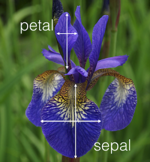
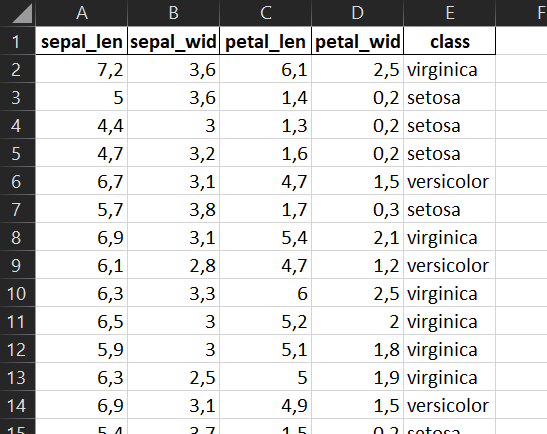

# A4.1 Case Study: Iris Datensatz

## Einführung

Der Iris-Datensatz enthält Messungen von jeweils 50 Blüten zu drei verschiedenen Lilien-Arten (setosa, versicolor, virginica)

Gemessen werden  pro [Blüte ](https://de.wikipedia.org/wiki/Bl%C3%BCte)in cm&#x20;

* die Länge und Breite des Kronblattes (Petalum, petal) sowie&#x20;
* die Länge und Breite des Kelchblattes (Sepalum, sepal)

## Datensatz

Folgender - in der Community wohlbekannter - Datensatz liegt uns vor (Sie finden die Daten [hier](https://syncandshare.lrz.de/getlink/fi89kxTJ5yLRaW5mnpyrofVK/Iris_p.xlsx)).

