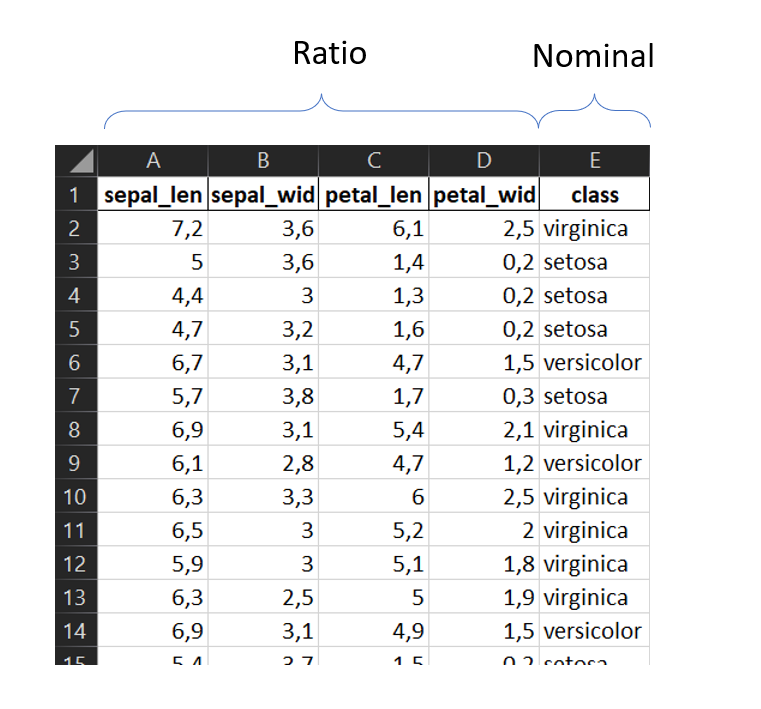

# Überblick

| Scale    | Operations    | Description                                                  | Statistics         | Example                                     |
| -------- | ------------- | ------------------------------------------------------------ | ------------------ | ------------------------------------------- |
| Nominal  | $$=, \neq$$   | values have no natural order; they describe unordered categories | Mode (Modus)       | München, Hamburg, Essen                     |
| Ordinal  | $$<, >$$      | values have a defined order; difference of values has no clear or meaningful  definition | Mean (Median)      | Schulnoten, Tabellenplatz in der Bundesliga |
| Interval | $$+,-$$       | differences of values have the same meaning; adding provides useful results; zero point is not naturally/globally defined | Mean               | Temperatur                                  |
| Ratio    | $$\cdot , /$$ | zero point is naturally defined                              | (Generalized) Mean | Alter                                       |

Bemerkungen:

1. Skalenniveaus sind nicht immer klar zuzuordnen.
1. Nominale und ordinale Datenskalen heißen auch *kategorisch*  oder *qualitativ*.
2. Intervall und Ratio-Datenskalen heißen auch _metrisch_.
3. Aus nominalen Datenskalen lassen sich stets  *künstliche Ordnungen* definieren.
4. Bilden sie keine Mittelwerte auf kategorischen Daten!

# Iris-Datensatz

Wir werden später folgende eindeutige Zuordnung  treffen:

| Nominaler Wert | Ordinaler Wert |
| :------------: | :------------: |
|     setosa     |       0        |
|   versicolor   |       1        |
|   virginica    |       2        |

