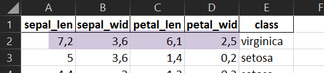
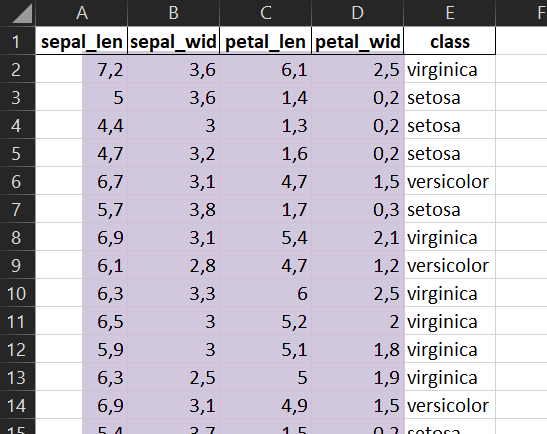
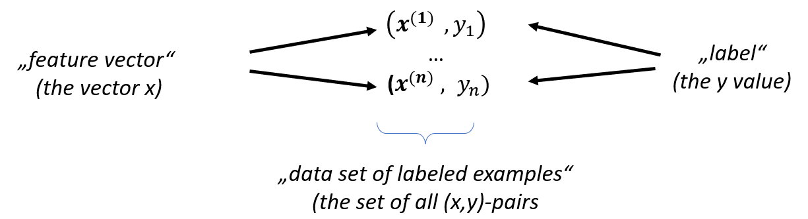

# A4.3 Feature, Label, Machine Learning

## Numerisches Feature (Merkmal)

> Ein numerisches Feature ist ein **Einzelaspekt **einer Beobachtung oder Messung unserer Objekte, der sich als Zahl ausdrücken lässt.

Ein Beispiel aus dem Iris-Datensatz ist  "Länge der Petalums".  Die Anzahl der Features einer Problemstellung nennen notieren wir mit dem Buchstaben $$m$$. Bei Iris: $$m = 4.$$&#x20;

## Feature-Vektor (Merkmals-Vektor)

Feature-Vektor ist eine Gruppierung der konkreten gemessenen Werte der numerischen Features als Vektor. Diese Gruppierung notiert man in der Regel als Zeilenvektor $$\bf{x} \in \mathbb{R}^{m}$$.&#x20; Ein Beispiel aus dem Iris-Datensatz ist der (erste) Feature-Vektor
$$
\textbf{x}= (7.2, 3.6, 6.1, 2.5 ) \in \mathbb{R}^4
$$

In nachfolgender Abbildung ist dieser Feature-Vektor farbig markiert.

Alternative Namen für den Feature-Vektor sind 

- Merkmals-Vektor
- Example
- Sample

## Feature-Matrix (Datensatz, Feature-Set)

Ein Datensatz (Feature-Set) $$X$$ ist eine (endliche) Menge von Feature-Vektoren gleicher Dimension $$m$$. Die Anzahl der Feature-Vektoren im Datensatz bezeichnen wir stets mit dem Buchstaben  $$n$$.&#x20; Wir indizieren mit einer hochgestellten Zahl in runden Klammern, um Verwechslungen mit einem Vektorelement zu vermeiden.
$$
\textbf{X} = \{\bf{x^{(1)}}, \ldots \bf{x^{(n)}}\} \subset \mathbb{R}^m
$$

Eine Feature-Matrix besteht aus n Feature-Vektoren, die die Zeilen der Spalten bilden. Wir notieren die Feature-Matrix ebenfalls mit dem Symbol $$X$$. 

Dann ist:

$$
\textbf{X} \in \mathbb{R}^{n \times m}
$$

Beispiel Iris:  Die Feature-Matrix $$X \in \mathbb{R}^{150 \times 4}$$  für Iris ist nachfolgend in farbig hinterlegt.&#x20;

## Label und Labeled Example

Zu jedem Feature-Vektor interessiert uns eine "Antwort"  oder ein "Ergebnis". Zum Beispiel fragen wir danach, zu welcher Gattung die Lilie mit dem Feature-Vektor $$\textbf{x}= (5, 3.6, 1.4, 0.2 )$$ gehört. Diese Information nennen wir **Label** zum Feature-Vektor $$\bf{x}$$. Wir bezeichnen den Label stets mit dem Buchstaben $$\bf{y}$$. Notieren wir den Feature-Vektor mit  $$\bf{x^{(i)}}$$, so schreiben wir $$\bf{y_i}$$ für den zugehörigen Label.  Der Label kann ein Vektor oder auch nur eine Zahl sein.  

## Machine Learning (ML)

Wir definieren zwei wichtige Begriffe:

##### Machine Learning

*Machine Learning* bezeichnet ein Programm oder System, das 

- mittels Analyse eines vorliegenden Datensatzes durch einen Algorithmus (mit menschlicher Hilfe) kostruiert wird und 
- aus einem Feature-Vektor in nützlicher Qualität Labels ableitet, die wir als *korrekt* bezeichnen.

##### Supervised und unsipervised learning

Enthält der Datensatz auch Labels so sprechen wir von *Supervised Learning*, andernfalls von *Unsupervised Learning*. 

