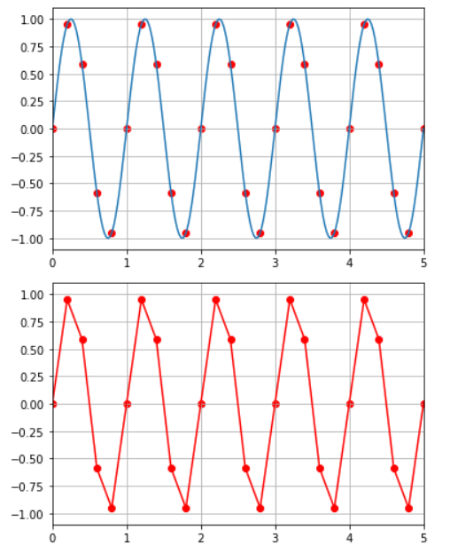

# A4.5 Sampling

Häufig entstehen Datensätze durch Messungen kontinuierlicher Größen in bestimmten Zeitabständen. Es bezeichne $$s$$ einen Sensor und $$s(t)$$ den Wert des Sensors $$t$$ Sekunden nach dem Start der Messung. Bezeichnen wir mit $$t$$  den zeitlichen Abstand zwischen zwei Messungen, so erhalten wir
$$
x_n = s(n \cdot t)
$$
Nachfolgende Abbildung zeigt ein Beispiel für $$s(x) = sin(2\pi \cdot x)$$ und $$t = 0.2$$. Die Sinuskurve hat eine Frequenz von $$1$$ Hz (Sie schwingt also einmal pro Sekunde). Wenn wir dieses Signal 5 mal pro Sekunde abtasten erhalten wir die roten Messungen (erste Grafik). In der zweiten Grafik sehen Sie das rekonstruierte Signalverlauf.



## Python-Code

```Python
import matplotlib.pyplot as plt
import numpy as np

SAMPLES = 25

def s(x):
  return np.sin( 2 * np.pi*x)


X_MAX = 5
z = np.linspace(0, X_MAX, 200);
plt.axis([0,5,-1.1,1.1])
plt.plot(z, s(z) )

x = np.linspace(0, X_MAX, SAMPLES+1);
plt.axis([0,5,-1.1,1.1])
plt.scatter(x, s(x), color="red" )


plt.grid(True)
plt.show()

plt.figure()
plt.grid(True)
plt.axis([0,5,-1.1,1.1])
plt.scatter(x, s(x), color="red" )
plt.plot(x, s(x), color="red")
plt.show()
```

