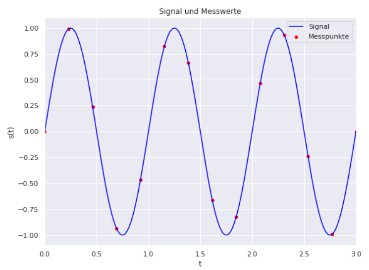
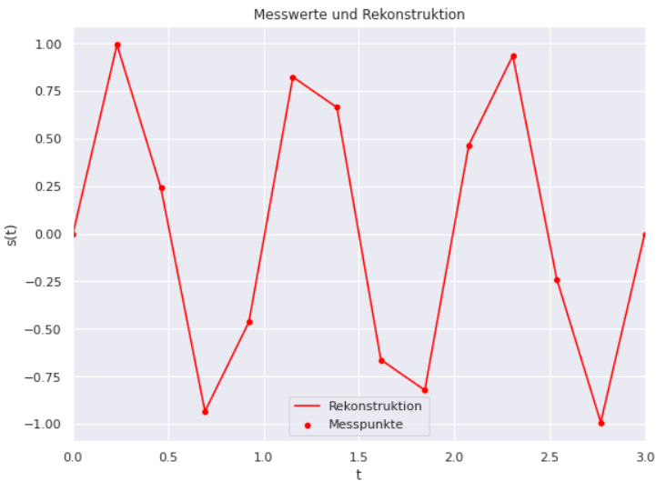

# A4.5 Sampling

Häufig entstehen Datensätze durch Messungen kontinuierlicher Größen in bestimmten Zeitabständen. Es bezeichne $$s$$ einen Sensor und $$s(t)$$ den Wert des Sensors $$t$$ Sekunden nach dem Start der Messung. Bezeichnen wir mit $$T$$  den zeitlichen Abstand zwischen zwei Messungen, so erhalten wir
$$
x^{(i)} = s(i \cdot T)
$$
Nachfolgende Abbildung zeigt ein Beispiel für $$s(t) = sin(2\pi \cdot t)$$ und $$T = 0.2$$. Die Sinuskurve hat eine Frequenz von $$1$$ Hz (Sie schwingt also einmal pro Sekunde). Wenn wir dieses Signal 5 mal pro Sekunde abtasten erhalten wir die roten Messungen (erste Grafik). In der zweiten Grafik sehen Sie den rekonstruierten Signalverlauf.







## Python-Code

```Python
import matplotlib.pyplot as plt
import seaborn as sns

import numpy as np


SAMPLES = 13

X_MAX = 3
h = np.linspace(0, X_MAX, 200);
x_werte = np.linspace(0, X_MAX, SAMPLES+1);

sns.set()

fig,ax = plt.subplots(figsize=(9, 9))
ax.set_title("Signal und Messwerte") 
ax.set_xlabel("t")
ax.set_ylabel("s(t)")
ax.set_aspect('equal')
ax.set_xlim(0, 3)

sns.lineplot(x=h, y=np.sin( 2 * np.pi * h) , color="blue", label="Signal")		
sns.scatterplot(x=x_werte, y=np.sin( 2 * np.pi * x_werte) , color="red", label="Messpunkte")		
plt.show()

fig,ax = plt.subplots(figsize=(9, 9))
ax.set_xlim(0, 3)
ax.set_title("Messwerte und Rekonstruktion") 
ax.set_xlabel("t")
ax.set_ylabel("s(t)")
ax.set_aspect('equal')
ax.set_xlim(0, 3)

sns.scatterplot(x=x_werte, y=np.sin( 2 * np.pi * x_werte) , color="red", label="Messpunkte")			
sns.lineplot(x=x_werte, y=np.sin( 2 * np.pi * x_werte) , color="red", label="Rekonstruktion")		
plt.show()
```


An dieser Stelle machen wir die ersten Schritte mit Python.
