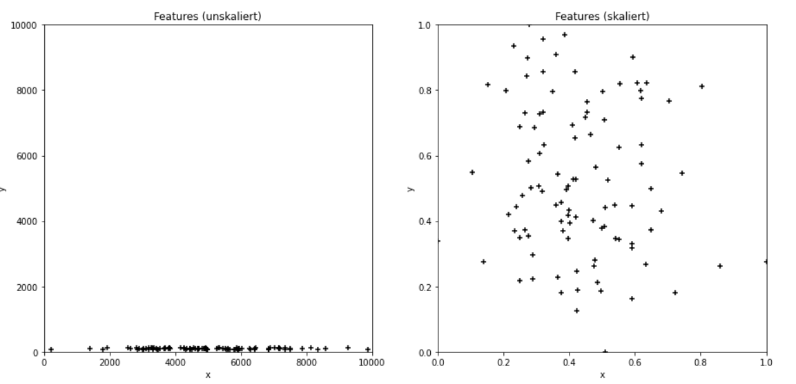
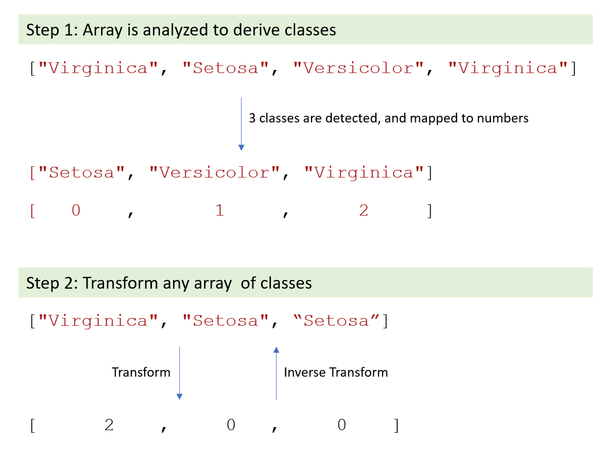
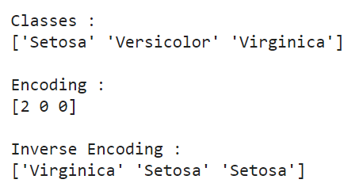
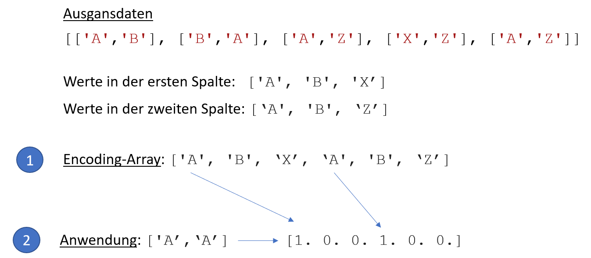

# Datentransformation

Die nachfolgenden Transformation (und ihre Varianten) treten häufig in der Vorverarbeitungsphase auf. Es ist aber stets gut zu überlegen, ob sie sinnvoll sind!

## Feature-Standardisierung (Min-Max-Scaling)

Ziel: Vermeiden extrem unterschiedlicher Wertebereiche verschiedener Features.

Beispiel: Nehmen wir an, dass in einem Datensatz mit zwei Features 

- das erste Feature $$x$$ einer Normalverteilung von mit $$\mu=5000,\sigma=2000$$ entspricht
- das zweite Feature  $$y$$ einer Normalverteilung von mit $$\mu=100,\sigma=20$$ entspricht

Dies kann für numerische Verfahren erhebliche Probleme bereiten. In vielen Fällen macht es Sinn metrische Features wie folgt in den Bereich von [0,1] zu skalieren:
$$
x_k = \frac{x_k - x_{min}}{x_{max} - x_{min}}
$$
Verfährt man für das zweite Feature y analog, so sieht Plot für skalierte und und unskalierte Daten wie folgt aus:



### Python-Code

```python
import numpy as np
import matplotlib.pyplot as plt

N = 100
x = np.random.normal(5000, 2000, N)
y = np.random.normal(100, 20, N)

fig, ax = plt.subplots(1,2, figsize=(15,7))
ax[0].set_xlim(0,10000)
ax[0].set_ylim(0,10000)
ax[0].set_aspect('equal')
ax[0].set_xlabel('x')
ax[0].set_ylabel('y')
ax[0].set_title('Features (unskaliert)')
ax[0].scatter(x, y, marker='+', color='black')
ax[1].set_xlim(0,1)
ax[1].set_ylim(0,1)
ax[1].set_aspect('equal')
ax[1].set_xlabel('x')
ax[1].set_ylabel('y')
ax[1].set_title('Features (skaliert)')
ax[1].scatter((x - x.min())/(x.max()-x.min()), (y - y.min())/(y.max()-y.min()), marker='+', color='black')

plt.show()
print(f"x-min/mean/x_max = {x.min()} / {x.mean()}/ {x.max()}")
print(f"y-min/mean/y_max = {y.min()} / {y.mean()} / {y.max()}")
```


## Feature-Binning

Wir teilen metrische Daten in Intervalle ein und erhalten so eine ordinale oder gröbere metrische Darstellung.

```python
from sklearn.preprocessing import KBinsDiscretizer
import numpy as np

# X muss eine Spaltenform haben, also shape [n,1] (deshalb reshape!)
X = np.array([0,1,2,3,4,5,6,7,8,9,10])
X = X.reshape(-1,1)

est = KBinsDiscretizer(n_bins=4, encode='ordinal', strategy='uniform')
est.fit(X)

print( est.bin_edges_)
Xt = est.transform( X )
print(Xt)
```


## Label-Transformation



### Python-Code (`Label-Encoder`)

```python
import numpy as np
from sklearn.preprocessing import LabelEncoder

le = LabelEncoder()
le.fit( ["Virginica", "Setosa", "Versicolor", "Virginica"] )
print( "Classes : ")
print( le.classes_)

print( "\nEncoding : ")
print( le.transform(["Virginica", "Setosa", "Setosa"]) )

print( "\nInverse Encoding : ")
print( le.inverse_transform([2,0,0]))
```

Output:



## One-Hot Encoding

One-Hot-Encoding ist eine Methode, um kategorische Daten als binäre Vektoren darzustellen. Folgende Grafik verdeutlicht die Methode und illustriert den Namen. 

One-Hot-Encoding funktioniert in folgenden beiden Schritten:

1. Extrahiere aus einem Feature/Label die auftretenden Kategorie-Werte
2. Transformiere den/die Kategorie-Wert/e in einen Vektor.



### Python-Code (`OneHotEncoder()`)

Glücklicherweise gibt es einen Funktion in `sklearn`, die das für uns erledigt. Folgender Code sollte einfach zu verstehen sein.

```python
from sklearn.preprocessing import OneHotEncoder

enc = OneHotEncoder(sparse=False)
enc.fit( [['A','B'], ['B','A'], ['A','Z'], ['X','Z'], ['A','Z']] )
print("\nKategorien: \n", enc.categories_)

# Transformieren eines Wertes
print("\nOne-Hot-Encoding von [A,Z] : \n", enc.transform( [['A','A']] ) )
```

Ausgabe:


### Übung

Versuchen sie obiges Beispiel in eine One-Hot-Encoder für Ziffern zu überführen, also 

0 -> [1, 0, 0, 0, 0, 0, 0, 0, 0, 0]

3 -> [0, 0, 0, 1, 0, 0, 0, 0, 0, 0]


