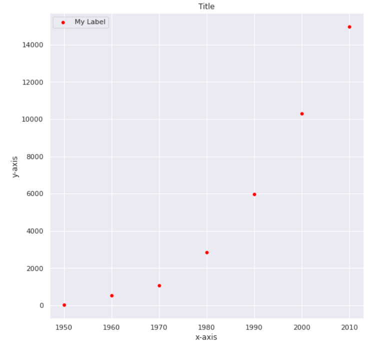
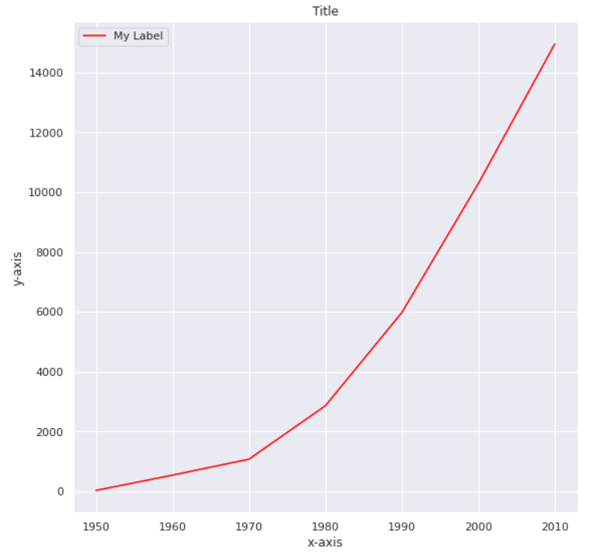
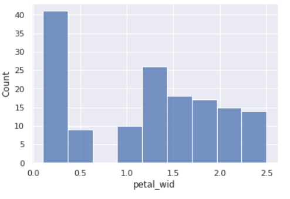
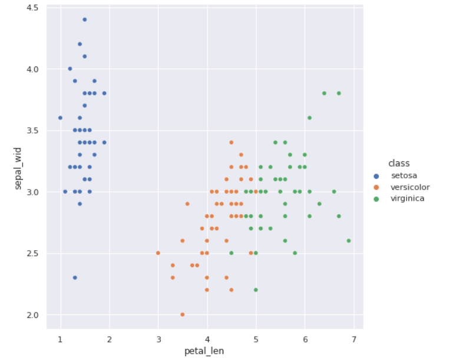
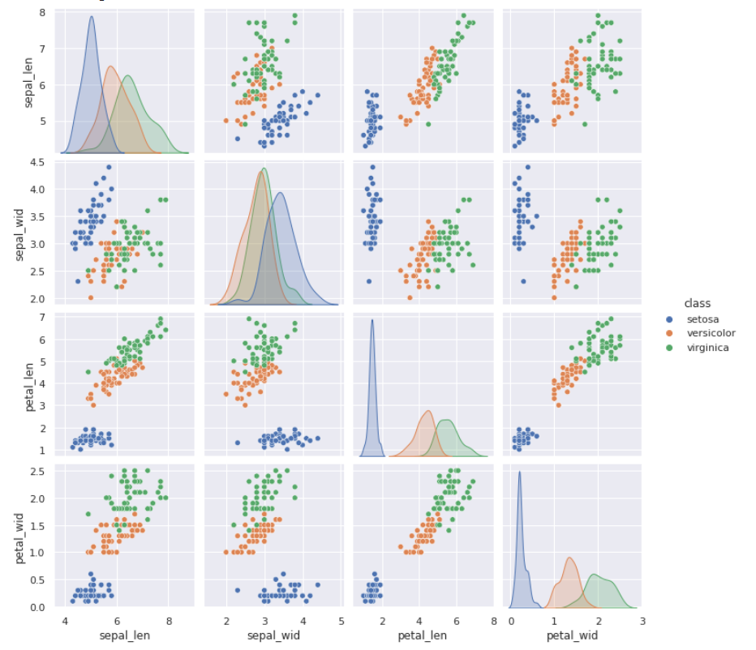

# 

# Matplotlib und Seaborn

Mathplotlib ([https://matplotlib.org/](https://matplotlib.org)) ist eine Sammlung von Funktionen (Bibliothek) zum Visualisieren von Daten. Wir verwenden mathplotlib zusammen mit dem ergänzenden Programmpaket Seaborn.  

Wichtig: Sie müssen die folgenden beiden Zeilen stets am Beginn des Programms stehen haben.

```python
import matplotlib.pyplot as plt
import seaborn as sns
```


# Plots

## Scatterplot

```python
#Scatterplot
import matplotlib.pyplot as plt
import seaborn as sns

years = [1950, 1960, 1970, 1980, 1990, 2000, 2010]
gdp = [33.2, 543.3, 1075.9, 2862.5, 5979.6, 10289.7, 14958.3]

fig,ax = plt.subplots(figsize=(9, 9))

ax.set_title("Title") 
ax.set_xlabel("x-axis")
ax.set_ylabel("y-axis")

#ax.set_aspect('equal')
#ax.set_xlim(0, 50)
#ax.set_ylim(0, 35)

sns.set()
sns.scatterplot(x=years, y=gdp, color="red", label="My Label")			
```



Hinweise:

- Zu Farben siehe : https://seaborn.pydata.org/tutorial/color_palettes.html (Vorsicht, anspruchsvoll)
- Formatierung der Achsen beachten


## Liniendiagramme

Hier ein erstes Beispiel:

```python
#Line
sns.scatterplot(x=years, y=gdp, color="red", label="My Label")
```



## Barplot

```
sns.barplot(x=years, y=gdp, color="red", label="My Label")
```


## Histogramme

```python
import matplotlib.pyplot as plt
import seaborn as sns

x_werte =  [1, 2,2, 3,3, 4, 5,6,7,8,9,10]

sns.set()
sns.histplot(x = x_werte,
             binwidth=0.99,
             kde = False)
```


# Plots für Iris

## Laden der Daten

```
import pandas as pd
from sklearn import datasets

import matplotlib.pyplot as plt
import seaborn as sns

iris = datasets.load_iris()
iris_df = pd.DataFrame(iris.data)
iris_df['class']=iris.target_names[iris.target ]
iris_df.columns=['sepal_len', 'sepal_wid', 'petal_len', 'petal_wid', 'class']
```


## Histogramm für ein Feature

```python
sns.set()
sns.histplot( iris_df, 
             x ="petal_wid", 
             bins=10,  # try bins="auto" und bins=10
             kde = False)
```



## Relation-Plots 

```
sns.relplot(data=iris_df, x="petal_len", y="sepal_wid", hue = "class", height=7)
```



## Pairplots

```
sns.pairplot(iris_df[['sepal_len', 'sepal_wid', 'petal_len', 'petal_wid', 'class']],
             hue="class", diag_kind="kde")
```

Ausgabe:




# Sandbox


## Alle Farben

Folgendes Programm gibt alle Farben mit Farbnamen aus:

```
from matplotlib.patches import Rectangle
import matplotlib.pyplot as plt
import matplotlib.colors as mcolors


def plot_colortable(colors, title, sort_colors=True, emptycols=0):

    cell_width = 212
    cell_height = 22
    swatch_width = 48
    margin = 12
    topmargin = 40

    # Sort colors by hue, saturation, value and name.
    if sort_colors is True:
        by_hsv = sorted((tuple(mcolors.rgb_to_hsv(mcolors.to_rgb(color))),
                         name)
                        for name, color in colors.items())
        names = [name for hsv, name in by_hsv]
    else:
        names = list(colors)

    n = len(names)
    ncols = 4 - emptycols
    nrows = n // ncols + int(n % ncols > 0)

    width = cell_width * 4 + 2 * margin
    height = cell_height * nrows + margin + topmargin
    dpi = 72

    fig, ax = plt.subplots(figsize=(width / dpi, height / dpi), dpi=dpi)
    fig.subplots_adjust(margin/width, margin/height,
                        (width-margin)/width, (height-topmargin)/height)
    ax.set_xlim(0, cell_width * 4)
    ax.set_ylim(cell_height * (nrows-0.5), -cell_height/2.)
    ax.yaxis.set_visible(False)
    ax.xaxis.set_visible(False)
    ax.set_axis_off()
    ax.set_title(title, fontsize=24, loc="left", pad=10)

    for i, name in enumerate(names):
        row = i % nrows
        col = i // nrows
        y = row * cell_height

        swatch_start_x = cell_width * col
        text_pos_x = cell_width * col + swatch_width + 7

        ax.text(text_pos_x, y, name, fontsize=14,
                horizontalalignment='left',
                verticalalignment='center')

        ax.add_patch(
            Rectangle(xy=(swatch_start_x, y-9), width=swatch_width,
                      height=18, facecolor=colors[name], edgecolor='0.7')
        )

    return fig

plot_colortable(mcolors.BASE_COLORS, "Base Colors",
                sort_colors=False, emptycols=1)
plot_colortable(mcolors.TABLEAU_COLORS, "Tableau Palette",
                sort_colors=False, emptycols=2)

plot_colortable(mcolors.CSS4_COLORS, "CSS Colors")

# Optionally plot the XKCD colors (Caution: will produce large figure)
# xkcd_fig = plot_colortable(mcolors.XKCD_COLORS, "XKCD Colors")
# xkcd_fig.savefig("XKCD_Colors.png")

plt.show()
```

