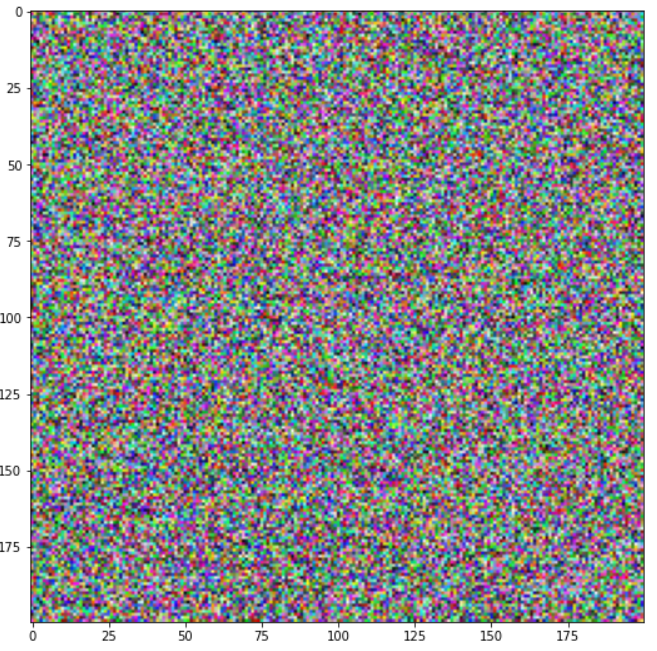
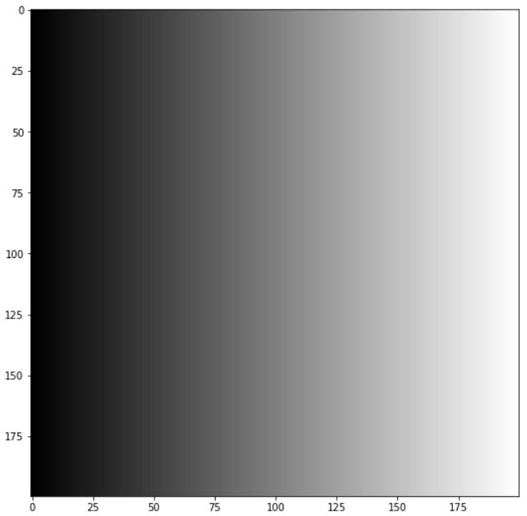
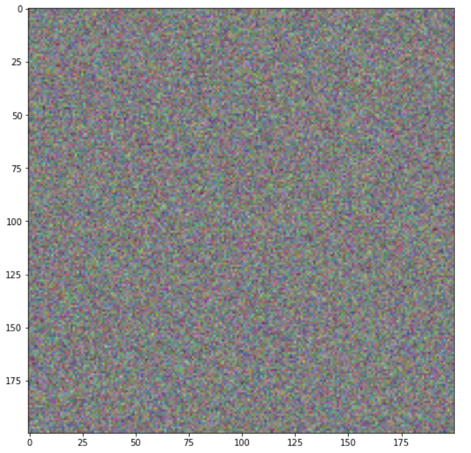

# Wofür brauchen wir Numpy?

Numpy ist eine Sammlung von Funktionen für effiziente Erzeugung, Berechnung und Bearbeitung von Zahlenstrukturen, zum Beispiel Vektoren oder Matrizen. &#x20;Wir werden Numpy-Arrays nutzen, um die Datensätze für maschinelles Lernen zu bearbeiten.

###### Links für diesen Abschnitt

| Link                                                                                                                                     | Beschreibung                                                                                                  |
| ---------------------------------------------------------------------------------------------------------------------------------------- | ------------------------------------------------------------------------------------------------------------- |
| [https://www.w3schools.com/python/numpy/default.asp](https://www.w3schools.com/python/numpy/default.asp)                                 | Eine umfangreiche, langsame Einführung. Wir brauchen davon aber nur, was in in diesem Script behandelt wird.  |
| [https://www.w3schools.com/python/numpy/numpy\_creating\_arrays.asp](https://www.w3schools.com/python/numpy/numpy\_creating\_arrays.asp) | arange                                                                                                        |
|                                                                                                                                          |                                                                                                               |

**Wichtig:** Beginnen Sie jeden Programmblock, in dem sie numpy-Funktionen brauchen, mit der Zeile

`import numpy as np`


# Einfache Funktionen

```python
import numpy as np

# Sinus
x = np.sin(0)
print( x )

# Quadrieren
x = np.square(3)
print( x )

# PI
x = np.pi
print( x )

# Eulersche Zahl
x = np.e
print( x )

# Gleichverteilt in [0,1[ 
x = np.random.random()
print(x)

# Erwartungswert 0, Standardabweichung 1
x = np.random.normal(0,1)
print(x)
```


# Vektoren 

Da Feature-Vektoren für uns eine wichtige Rolle spielen, gehen wir näher auf Vektoren in Numpy ein. 


## Erzeugung  "per Hand"

Folgende Befehle erläutern das Thema Vektoren, elementweise Addition, elementweise Multiplikation und Skalarprodukt für Vektoren. Wichtig für die Erzeugung eines Vektors ist Zeile 3.

```python
import numpy as np

y = np.array([5,6,7,8])     # Definiere Vektor y
x = np.array([1,2,3,4])     # Definiere Vektor x
print (f'x    = {x}' )      # Drucke Werte
print (f'y    = {y}' )      # Drucke y
```


## `np.ones() und np.zeros()`

`np.ones(n)` erzeugt einen Vektor der Dimension n, der nur aus Einsen besteht. Analog funktioniert `np.zeros`

```python
v = np.ones(10)
w = np.zeros(10)
```


## `np.arange`()

Mit `np.arange` erzeugen wir automatisch Strukturen, die wir häufiger brauchen. Beschäftigen Sie sich mit den Ausgaben und experimentieren sie etwas, dann wird die jeweilige Funktion recht schnell klar.

```python
import numpy as np

x = np.arange(1,2,0.1)
print( x )
print( x[2] )
print( len(x) )
print ( type(x) )
```


##  `np.linspace`()

```python
import numpy as np

x = np.linspace(0,2*np.pi,20);
print(x)
print( len(x))
```


## Elementweise Operationen

 Nachfolgendes Beispiel zeigt ausgewählte Operationen. Beachten Sie, dass sie die letzten 4Operationen so im Mathe-Unterricht nicht gelernt haben. Sie sind jedoch recht hilfreich!

```python
import numpy as np
x = np.array([1, 4, 9, 0])
y = np.array([1, 0, 1, 0])

print(x*0.5)
print(x+y)
print (x.dot(y))

print (x+1)
print(x*y)
print (np.sqrt(x))
print (np.sin(x))
```


### Übung

Berechnen Sie durch Programmbefehle $$v^Tw,$$ $$v+w$$ und $$2 \cdot v$$ für

$$
v = \begin{bmatrix} 1 \\ -3 \\ 2\\ \end{bmatrix} \quad \text{and} \quad w = \begin{bmatrix} 1 \\ 0 \\ 13\\ \end{bmatrix}
$$


## Zufallszahlen

Link: [https://www.w3schools.com/python/numpy/numpy\_random.asp](https://www.w3schools.com/python/numpy/numpy\_random.asp)

```python
import numpy as np

# Gleichverteilt in [0,1[, 10 Werte
ua = np.random.random(10)
print(ua)

# Erwartungswert 0, Standardabweichung 1, 10 Werte
na = np.random.normal(0,1,10)
print(na)
```


# Matrix

Sie erinnern sich an die Feature-Matrix? Also, los gehts..


## Basics

Matrizen werden in Numpy als eine Ansammlung von Zeilenvektoren aufgebaut!

```python
A = np.array([[1,2],[3,4], [5,6], [7,8]])
print( A )
print( A[0,0] )
print( A[0,1] )
```

Obiges Programm ergibt die nachfolgende Ausgabe. Die Indizierung der Element funktioniert erwartungsgemäß, allerdings wird mit der Zählung bei Null begonnen!

 (1) (1) (1).png>)


## Shape (Dimension)

Eine Matrix hat eine Anzahl von Zeilen und Spalten, die wir üblicherweise mit n und m bezeichnet haben. Folgender Befehl liefert die Anzahl der Zeilen und Spalten einer Matrix:

```python
import numpy as np
A = np.array([[1,2],[3,4], [5,6], [7,8]])
print( A.shape )  # Ausgabe: (4,2)
```

Die Ausgabe (4,2) besagt, dass die Matrix vier Zeilen und zwei Spalten besitzt.

## Addition und Multiplikation mit einem Skalar

```python
A = np.array([[1,2],[3,4], [5,6], [7,8]])
B = np.array([[10,20],[30,40], [50,60], [70,80]])
s = 2;
print (2*A)     # Mulitplikation mit einem Skalar
print (A+B)
```


## Vertiefend

### Zeilenvektoren und Spaltenvektoren

In NumPy gibt es keine Identifikation von Vektoren mit Spaltenvektoren! Folgendes Beispiel zeigt, dass Phython Vektoren nicht mit Spaltenvektoren oder gar Zeilenvektoren identifiziert.

```python
import numpy as np
x_vektor        = np.array([1,2,3])   
x_zeilenvektor  = np.array([[1,2,3]]) 
x_spaltenvektor = np.array([[1], [2], [3]])

print(f'x_vektor        :{x_vektor}')
print(f'x_zeilenvektor  :{x_zeilenvektor}')
print(f'x_spaltenvektor :{x_spaltenvektor}')

print(f'Shape x_vektor        :{x_vektor.shape}')
print(f'Shape x_zeilenvektor  :{x_zeilenvektor.shape}')
print(f'Shape x_spaltenvektor :{x_spaltenvektor.shape}')
```

Wir müssen uns also stets überlegen, ob wir mit einer Matrix oder einem Vektor operieren wollen.


### Transponierung

```python
A = np.array([[1,2],[3,4], [5,6], [7,8]])
AT = np.transpose(A)
print(AT)
```


### Matrixmultiplikation

Die Matrixmultiplikation erfolgt ebenfalls über den Befehl `np.dot`

```python
A = np.array([[1,2],[3,4], [5,6], [7,8]])
B = np.array([[10,20],[30,40], [50,60], [70,80]])

C = np.dot(A, np.transpose(B))   # Addition
```


# Beispiele: Bilder

Bilder lassen sich als Numpy-Arrays darstellen und bearbeiten. Unterstützte shapes sind:

* (M, N): ein Bild mit skalaren Werten (0-1 float oder 0-255 int). Visualisierung erfolgt über eine _colormap_.
* (M, N, 3): ein Farbbild mit RGB Werten (0-1 float oder 0-255 int).

Die ersten beiden Werte (M, N) definieren die Anzahl der Zeilen und Spalten des Bildes.

(Taken from [https://matplotlib.org/3.1.1/api/\_as\_gen/matplotlib.pyplot.imshow.html](https://matplotlib.org/3.1.1/api/\_as\_gen/matplotlib.pyplot.imshow.html))


## Grauwert-Bilder als nxm Matrix

Folgende Befehle erzeugen ein künstliches und (gleichverteilt) zufälliges Grauwertbild:

```python
import matplotlib.pyplot as plt
import numpy as np

img = np.random.rand(10,10)
plt.imshow(img, cmap= plt.cm.get_cmap('Oranges'), vmin=0, vmax=1  )
```

Colormaps finden sie unter [https://matplotlib.org/3.1.0/tutorials/colors/colormaps.html](https://matplotlib.org/3.1.0/tutorials/colors/colormaps.html). Sie können auch probieren: 'Greys', 'Purples', 'Blues', 'Greens', 'Oranges', 'Reds', 'YlOrBr', 'YlOrRd', 'OrRd', 'PuRd', 'RdPu', 'BuPu', 'GnBu', 'PuBu', 'YlGnBu', 'PuBuGn', 'BuGn', 'YlGn'


## Farbbilder aus Datei laden

```python
import numpy as np
import matplotlib.pyplot as plt

url = 'http://www.dietergreipl.de/wp-content/uploads/2019/10/owl-50267_1920.png'
eule = plt.imread( url )
print(eule.shape)
print(np.amax( eule ))
print(np.amin( eule ))
plt.figure( figsize=(20,15))
plt.imshow( eule )
```


## Einfache Farbbilder erzeugen

```python
import numpy as np
import matplotlib.pyplot as plt
img = np.zeros( (200,200,3))
img[:,:,1] = np.ones((200))
plt.figure()
plt.imshow( img  )
```


## Komplett zufälliges Farbbild

```python
import numpy as np
import matplotlib.pyplot as plt
img = np.random.random( 200*200*3).reshape(200,200,3)
plt.figure(figsize= (9,9))
plt.imshow( img  )
```




### Übungen 

#### Wie kommt dieses Bild zustande?

Erläutern Sie, wie das Bild erstellt wird, speziell die for-Schleife:

```python
import numpy as np
import matplotlib.pyplot as plt

img= np.ones((200, 200))

for col in range(0, 200):
  img[:,col] = col

plt.figure(figsize= (9,9))
plt.imshow( img, cmap= plt.get_cmap('gray'), vmin=0, vmax=200)
```

Ausgabe:



#### Erklären sie die Ausgabe dieses Programms:

```
import numpy as np
import matplotlib.pyplot as plt
img = np.random.normal(0.5, 0.1, 200*200*3).reshape(200,200,3)
plt.figure(figsize= (9,9))
plt.imshow( img  )
```

Ausgabe:


