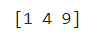
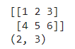
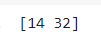

# Wofür brauchen wir Numpy?

Numpy ist eine Sammlung von Funktionen für effiziente Erzeugung, Berechnung und Bearbeitung von Zahlenstrukturen, zum Beispiel Vektoren oder Matrizen. &#x20;Wir werden Numpy-Arrays nutzen, um die Datensätze für maschinelles Lernen zu bearbeiten.

###### Links für diesen Abschnitt

| Link                                                                                                                                     | Beschreibung                                                                                                  |
| ---------------------------------------------------------------------------------------------------------------------------------------- | ------------------------------------------------------------------------------------------------------------- |
| [https://www.w3schools.com/python/numpy/default.asp](https://www.w3schools.com/python/numpy/default.asp)                                 | Eine umfangreiche, langsame Einführung. Wir brauchen davon aber nur, was in in diesem Script behandelt wird.  |
| [https://www.w3schools.com/python/numpy/numpy\_creating\_arrays.asp](https://www.w3schools.com/python/numpy/numpy\_creating\_arrays.asp) | arange                                                                                                        |
|                                                                                                                                          |                                                                                                               |

**Wichtig:** Beginnen Sie jeden Programmblock, in dem sie numpy-Funktionen brauchen, mit der Zeile

`import numpy as np`


# Einfache Funktionen

```python
import numpy as np

# Sinus
x = np.sin(0)
print( x )

# Quadrieren
x = np.square(3)
print( x )

# PI
x = np.pi
print( x )

# Eulersche Zahl
x = np.e
print( x )

# Gleichverteilt in [0,1[ 
x = np.random.random()
print(x)

# Erwartungswert 0, Standardabweichung 1
x = np.random.normal(0,1)
print(x)
```


# Vektoren (eindimensional)

```python
import numpy as np

x = np.array([1,2,3])
print(x)
print(x[0])
print( len(x) )
print( type(x) )
```

In obigem Beispiel entspricht x einem Vektor :
$$
x = \begin{bmatrix} 1 \\ 2  \\ 3  \end{bmatrix}
$$


## `np.arange`

Mit `np.arange` erzeugen wir automatisch Strukturen, die wir häufiger brauchen. Beschäftigen Sie sich mit den Ausgaben und experimentieren sie etwas, dann wird die jeweilige Funktion recht schnell klar.

```python
import numpy as np

x = np.arange(1,2,0.1)
print( x )
print( x[2] )
print( len(x) )
print ( type(x) )
```


##  `np.linspace`

```python
import numpy as np

x = np.linspace(0,2*np.pi,20);
print(x)
print( len(x))
```


## Zufallszahlen

Link: [https://www.w3schools.com/python/numpy/numpy\_random.asp](https://www.w3schools.com/python/numpy/numpy\_random.asp)

```python
import numpy as np

# Gleichverteilt in [0,1[, 10 Werte
ua = np.random.random(10)
print(ua)

# Erwartungswert 0, Standardabweichung 1, 10 Werte
na = np.random.normal(0,1,10)
print(na)
```


# Funktionen auf Vektoren

Hier passiert etwas, das sie in der Mathematik nie gesehen haben. Wir können z.B. einen Vektor quadrieren (!) und das Ergebnis ist ein Vektor:

```
import numpy as np

x = np.array([1,2,3])
print( np.square(x))
```

Ausgabe:



Probieren sie das auch mit dem Sinus! Das ist außergewöhnlich hilfreich, wie wir später noch sehen werden.


# Matrizen

Wir können mit numpy auch Matrizen, also zwei-dimensionale Strukturen erzeugen:

```python
A = np.array([[1,2,3], [4,5,6]])
print(A)
```



Sie kennen das als:
$$
A = \begin{bmatrix} 1 & 2 & 3 \\ 4 & 5 & 6 \end{bmatrix}
$$
Sie können sich vielleicht noch an die Matrixmultiplikation erinnern?
$$
\begin{bmatrix} 1 & 2 & 3 \\ 4 & 5 & 6 \end{bmatrix} \begin{bmatrix} 1 \\ 2  \\ 3  \end{bmatrix} = \begin{bmatrix} 14 \\ 32  \end{bmatrix}
$$


```python
A = np.array([[1,2,3], [4,5,6]])
v = np.array([1,2,3])
r = A.dot(v)
print (r)
```



## Shape

Der Shape beschreibt die Dimensionen eines np.arrays. Die Matrix $$A$$ aus obigem Beispiel hat shape (2,3), besteht also aus zwei Zeilen und drei Spalten.

```python
A = np.array([[1,2,3], [4,5,6]])
print(A.shape)
```

### 

# Beispiele: Bilder

Bilder lassen sich als Numpy-Arrays darstellen und bearbeiten. Unterstützte shapes sind:

* (M, N): ein Bild mit skalaren Werten (0-1 float oder 0-255 int). Visualisierung erfolgt über eine _colormap_.
* (M, N, 3): ein Farbbild mit RGB Werten (0-1 float oder 0-255 int).

Die ersten beiden Werte (M, N) definieren die Anzahl der Zeilen und Spalten des Bildes.

(Taken from [https://matplotlib.org/3.1.1/api/\_as\_gen/matplotlib.pyplot.imshow.html](https://matplotlib.org/3.1.1/api/\_as\_gen/matplotlib.pyplot.imshow.html))


## Grauwert-Bilder als nxm Matrix

Folgende Befehle erzeugen ein künstliches und (gleichverteilt) zufälliges Grauwertbild:

```python
import matplotlib.pyplot as plt
import numpy as np

img = np.random.rand(10,10)
plt.imshow(img, cmap= plt.cm.get_cmap('Oranges'), vmin=0, vmax=1  )
```

Colormaps finden sie unter [https://matplotlib.org/3.1.0/tutorials/colors/colormaps.html](https://matplotlib.org/3.1.0/tutorials/colors/colormaps.html). Sie können auch probieren: 'Greys', 'Purples', 'Blues', 'Greens', 'Oranges', 'Reds', 'YlOrBr', 'YlOrRd', 'OrRd', 'PuRd', 'RdPu', 'BuPu', 'GnBu', 'PuBu', 'YlGnBu', 'PuBuGn', 'BuGn', 'YlGn'


## Farbbilder aus Datei laden

```python
import numpy as np
import matplotlib.pyplot as plt

url = 'http://www.dietergreipl.de/wp-content/uploads/2019/10/owl-50267_1920.png'
eule = plt.imread( url )
print(eule.shape)
print(np.amax( eule ))
print(np.amin( eule ))
plt.figure( figsize=(20,15))
plt.imshow( eule )
```


## Einfache Farbbilder erzeugen

```python
import numpy as np
import matplotlib.pyplot as plt
img = np.zeros( (200,200,3))
img[:,:,1] = np.ones((200))
plt.figure()
plt.imshow( img  )
```


## Komplett zufälliges Farbbild

```python
import numpy as np
import matplotlib.pyplot as plt
img = np.random.random( 200*200*3).reshape(200,200,3)
plt.figure(figsize= (9,9))
plt.imshow( img  )
```


### Übungen 

#### Wie kommt dieses Bild zustande?

Erläutern Sie, wie das Bild erstellt wird, speziell die for-Schleife:

```python
import numpy as np
import matplotlib.pyplot as plt

img= np.ones((200, 200))

for col in range(0, 200):
  img[:,col] = col

plt.figure(figsize= (9,9))
plt.imshow( img, cmap= plt.get_cmap('gray'), vmin=0, vmax=200)
```

Ausgabe:


#### Erklären sie die Ausgabe dieses Programms:

```
import numpy as np
import matplotlib.pyplot as plt
img = np.random.normal(0.5, 0.1, 200*200*3).reshape(200,200,3)
plt.figure(figsize= (9,9))
plt.imshow( img  )
```

Ausgabe:


