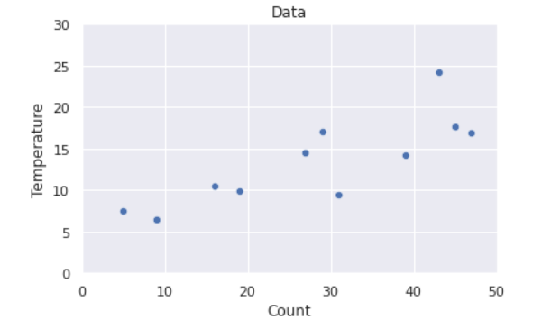
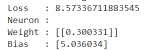
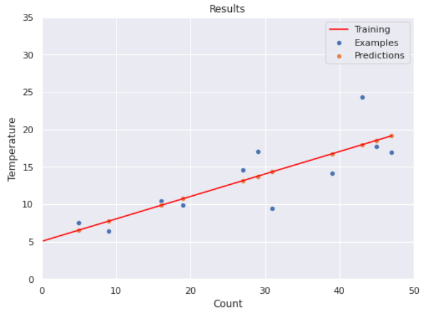
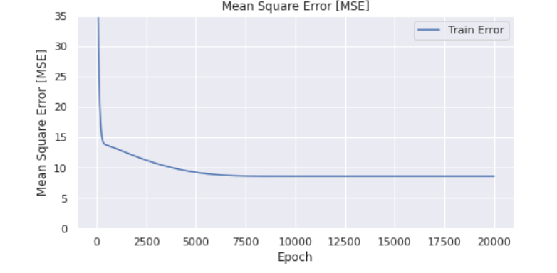

Anhand des Zirpens von Grillen kann man mehr oder weniger verlässlich die Lufttemperatur berechnen. Die Körperfunktionen von Grillen verändern sich wie bei anderen Insekten auch durch veränderte Lufttemperatur. Denn wie alle Insekten sind Grillen kaltblütig und nehmen die sie umgebende Temperatur an. Je wärmer, desto häufigeres Zirpen. Ist es wärmer, laufen die Körperfunktionen – wie auch Bewegungen – schneller ab, die Grillen sind aktiver. \[…] Da Grillen also bei erhöhter Temperatur häufiger Zirpen, kann man aus der Häufigkeit des Zirpens die Lufttemperatur ableiten. Die Formel dafür ist sehr simpel. Um die Temperatur in Grad Celsius zu errechnen, zählt man das Zirpen einer einzelnen Grille in einem Intervall von 25 Sekunden.


# Dataset

Nehmen wir an, dass folgende kleine Menge von labelled examples vorliegt: 

.png>)

Natürlich wollen wir nun - wie üblich - aus dem feature den label vorhersagen. Offensichtlich handelt es sich um ein Regressionsproblem. 

Mit folgendem Code definieren wir unseren Dataset:

```python
df = pd.DataFrame({
    "Count": [31,16,29,43,27,19,47,9,45,5,39],
    "Temp": [9.4,10.5,17.1,24.3,14.6,9.9,16.9,6.4,17.7,7.5,14.2]   
})
```


Visualisuerung




Phyton

```python
%tensorflow_version 2.x
import numpy as np
import pandas as pd

import matplotlib.pyplot as plt
import seaborn as sns

df = pd.DataFrame({
    "Count": [31,16,29,43,27,19,47,9,45,5,39],
    "Temp": [9.4,10.5,17.1,24.3,14.6,9.9,16.9,6.4,17.7,7.5,14.2]
    
})

X = df["Count"]
y = df["Temp"]

print( X.shape )
print( y.shape )

sns.set()
fig,ax = plt.subplots(figsize=(6, 6))
ax.set_aspect("equal")
ax.set_xlim(0, 50)
ax.set_ylim(0, 30)

ax.set_title("Data")
ax.set_xlabel("Count")
ax.set_ylabel("Temperature")
sns.scatterplot(x = X, y = y)
```


# Das "Grillen-Neuron"

Wenn wir ein Neuron mit _einem _Eingabewert und _linearer Activation_ bauen, so ist die Ausgabe des Neurons

$$
y = M(x) = x \cdot w +b
$$

Wir suchen also $$w$$ und $$b$$  in $$\mathbb{R}$$, so dass unser dadurch definiertes Modell unseren Datensatz möglichst gut vorhersagt. Offenbar ist M für fest gewähltes w und b eine lineare Funktion, die wir gut visualisieren können.


# Neuronales Netz und Learning

Folgender Code erzeugt die Modellfamilie und berechnet dann das optimale Modell:

```python
from tensorflow.keras.models import Sequential
from tensorflow.keras.layers import Dense, Activation
from tensorflow.keras import optimizers
from keras.utils.vis_utils import plot_model
import pandas as pd

import seaborn as sns


# Acvtivations: linear, relu, sigmoid, tanh, 
model = Sequential()
model.add( Dense(1, activation='linear') )
model.compile(loss='mean_squared_error', optimizer='adam')

# Run the training
history = model.fit(X,y, verbose=0, epochs= 20000)

# We display the weighst and biases
print(f'Loss   : {history.history["loss"][-1]}')

print("Neuron :")
[weight, bias] = model.layers[0].get_weights();
print(f'Weight : {weight}')
print(f'Bias   : {bias}')
```

(Mögliche) Ausgabe: 




##  Visualisierung des gelernten Modells

Folgende Grafik visualisiert das Geschehen bisher:

* Die blauen Punkte zeigen die _labelled examples_
* Die orangen Punkte zeigen die _predictions _für die features
* Die rote Linie visualisiert das Modell, als Ergebnis des Trainings 




## Visualisierung der Fehlerfunktion

Der MSE ist eine reelle Zahl, die von w und b abhängt.  Wir können daher den MSE-Graph als Fläche über der Weight-Bias Eben plotten. 

.png>)

Am tiefsten Punkt der Fläche haben wir das beste Modell gefunden. Der kleine Punkt in der Grafik markiert in etwa diesen Punkt.


## Gradientenabstieg (_gradient descent_)

Wir haben eben gesehen, dass die Fehlerfunktion MSE nur von w und b abhängt. Das Minimum von Funktionen lässt sich unter bestimmten Umständen durch die erste Ableitung berechnen. In der Praxis gelingt das aber nur selten. Erfolgversprechender ist das sukzessive Absteigen  auf der Fläche. Da unserer Fehlerfunktion differenzierbar ist, ist der negative Gradient die beste Abstiegsrichtung.

In folgender Abbildung ist ein willkürlicher "Abstiegspfad" eingezeichnet:

  

-16393293673732.png)


Das Abstiegsverfahren lässt sich etwas besser anhand eines Grafen einer Loss-Funktion $$L: \mathbb{R} \rightarrow \mathbb{R}$$ veranschaulichen. Wir nehmen dabei an, dass wir den Loss (=MSE) nur entlange der w-Achse minimieren wollen, also  angenommen, dass der Loss  nur von $$w$$ abhängt.  


.png)


#### Begründung des Abstiegs

Ist L differenzierbar und  $$L´(x_0) < 0$$ für einen zufällig gewählten Startwert $$x_0$$ , so gilt wegen
$$
L^´(w_0) = \lim_{h \rightarrow 0} \frac{L(x_0+h) - L(x_0)}{h}  <0
$$

für hinreichend kleines $$h_0 > 0$$:

$$
\frac{L(x_0+h_0) - L(x_0)}{h_0}  <0
$$

und damit

$$
L(x_0+h_0) < L(x_0)
$$

Nun setzt man $$x_1 = x_0 + h_0$$ und fährt weiter fort. 


## Trainingsschritt und Epochen

Ein **Trainingsschritt **(learning-step) ist eine neue Festlegung der Parameter eines Modells, so dass der Loss kleiner wird. Diese neue Festlegung funktioniert auf der Basis des Gradienten der Loss-Funktion. In obigem Beispiel wäre der Trainingsschritt $$h_0.$$ Eine **Epoche **ist ein Trainingsschritt auf der Grundlage aller Trainingsdaten. Wir identifizieren für den Moment eine Epoche mit einem Abstiegsschritt.


## Visualisierung des Lernfortschritts




# Vertiefung : Analytische Berechnung des Optimums&#x20;


## Herleitung

Für die MSE-Verlustfunktion

$$
L(w,b)  = \sum_{i=0}^{n-1} (x_iw +b -y _i)^2
$$

ist&#x20;

$$
\begin{align}
\frac{\partial L}{\partial w} 
&= 2\sum_{i=0}^{n-1} (x_iw +b -y _i)  x_i  \\
&= 2\sum_{i=0}^{n-1} (x_i^2 w +x_ib -x_iy _i)  \\
&= 2w\sum_{i=0}^{n-1} x_i^2 +2b \sum_{i=0}^{n-1} x_i  - 2\sum_{i=0}^{n-1}x_iy_i 
\end{align}
$$

und

$$
\begin{align}
\frac{\partial L}{\partial b} 
&= 2\sum_{i=0}^{n-1} (x_i w +b - y_i)   \\
&= 2 w \sum_{i=0}^{n-1} (x_i) + 2nb - 2 \sum_{i=0}^{n-1}y_i 
\end{align}
$$

Setzt man $$\frac{\partial L}{\partial w} =0$$ , $$\frac{\partial L}{\partial b} =0$$ , so erhält man zwei lineare Gleichungen, die es erlauben den optimalen Wert $$w^*$$ und $$b^*$$ zu berechnen.


## Beispiel

Wir verwenden die obigen Werte:

.png>)


Damit ergibt sich (gerundet, mit Hilfe von Excel und nach Division durch den Faktor von $$w^*$$):
$$
\begin{align}
0 &= w^* + 0,0285503776017683 \cdot b^* - 0,444114938294345 \\
0 &= w^* + 0,0354838709677419 \cdot b^* -0,479032258064516 
\end{align}
$$

und damit

$$
\begin{align}
 w^* &= 0,300334218870512 \\
b^* &= 5,03603565001285 
\end{align}
$$

Schließlich ergibt sich mit dem entsprechenden Modell als minimaler Loss der Wert&#x20;

$$
8,57336688506454
$$

Vergleichen Sie die Werte mit dem Ergebnis unseres neuronalen Netzes!
