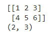
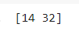

# Numpy-Arrays

Wir werden Numpy-Arrays nutzen um mit Vektoren und Matrizen zu arbeiten.

# Vektoren (eindimensional)

```python
import numpy as np

x = np.array([1,2,3])
print(x)
print( len(x) )
print( type(x) )
print( x.shape )
```

In obigem Beispiel entspricht x einem Vektor :
$$
v = \begin{bmatrix} 1 \\ 2  \\ 3  \end{bmatrix}
$$
Beachten Sie, dass es sich um einen Spaltenvektor handelt! 

## Beispiele:`arange` und  `linspace`

Die folgenden beiden numpy-Funktionen erzeugen automatisch Arrays, die wir häufiger brauchen. Beschäftigen Sie sich mit den Ausgaben und experimentieren sie etwas, dann wird die jeweilige Funktion recht schnell klar.

#### `arange`

```python
import numpy as np

x = np.arange(1,2,0.1)
print( x )
print( x[2] )
print( len(x) )
print ( type(x) )
```

####  `linspace`

```python
import numpy as np

x = np.linspace(0,2*np.pi,20);
print(x)
print( len(x))
```

## Beispiele: Zufallszahlen

Link: [https://www.w3schools.com/python/numpy/numpy\_random.asp](https://www.w3schools.com/python/numpy/numpy\_random.asp)

Wir erzeugen gleichverteilte und normalverteilte Zufallszahlen. Sie helfen uns bei Simulationen und machen unsere Beispiel etwas vitaler.

```python
import numpy as np

# Gleichverteilt in [0,1[, 10 Werte
u = np.random.random()
print(u)

# Erwartungswert 0, Standardabweichung 1, 10 Werte
n = np.random.normal(0,1)
print(type(n)

```

Auch Listen von Zufallszahlen lassen sich einfach erzeugen. Beachten Sie den Unterschied zwischen beiden Varianten!

```python
import numpy as np

# Gleichverteilt in [0,1[, 10 Werte
ua = np.random.random(10)
print(ua)

# Erwartungswert 0, Standardabweichung 1, 10 Werte
na = np.random.normal(0,1,10)
print(na)
```

## Visualisierungsübung 1


1. Sie können mit numpy  eine Liste mit 50 gleichverteilen Zufallszahlen erstellen. Erzeugen Sie zwei dieser Listen (x und y) und zeigen sie die Paare (x\[i], y\[i]) in einem Scatterplot an. ([Lösung](../../vertiefungen/loesungen-und-vertiefungen.md#scatterplot-von-paaren-aus-zufallszahlen))
2. Welches Ausgabe erwarten Sie, wenn Sie jeweils 2000 Zahlen erzeugen?
3. Wiederholen sie Aufgabe 1 mit der Normalverteilung statt der Gleichverteilung. Überlegen sie  bitte vorher: welche grafischen Ausgabe erwarten sie?
4. Erzeugen Sie ein Histogramm für die Erzeugung von 10000 gleichverteilten (normaverteilten) Zufallszahlen

## Visualisierungsübung 2

Nachfolgendes Programm visualisiert eine Sinuskurve.

```python
import numpy as np
import matplotlib.pyplot as plt

x = x = np.linspace(0,2*np.pi,20);
plt.figure()
plt.plot(x, np.sin(x), 'r--')
```

.png>)

# Matrizen

Wir können mit numpy auch Matrizen, also zwei-dimensionale Strukturen erzeugen:

```
A = np.array([[1,2,3], [4,5,6]])
print(A)
print( A.shape) 
```



Sie kennen das als:
$$
A = \begin{bmatrix} 1 & 2 & 3 \\ 4 & 5 & 6 \end{bmatrix}
$$
Sie können sich vielleicht noch an die Matrixmultiplikation erinnern?
$$
\begin{bmatrix} 1 & 2 & 3 \\ 4 & 5 & 6 \end{bmatrix} \begin{bmatrix} 1 \\ 2  \\ 3  \end{bmatrix} = \begin{bmatrix} 14 \\ 32  \end{bmatrix}
$$


```
A = np.array([[1,2,3], [4,5,6]])
v = np.array([1,2,3])
r = A.dot(v)
print (r)
```


