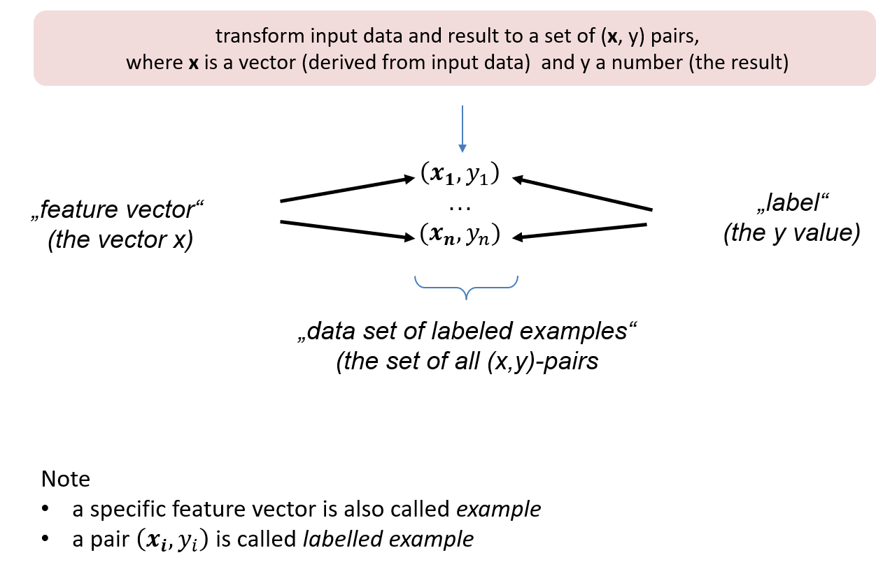

# A4.3 Feature, Label, Machine Learning

## Numerische Features (Merkmal)

> Ein numerisches Feature ist ein **Einzelaspekt **einer Beobachtung oder Messung unserer Objekte, der sich als Zahl ausdrücken lässt.

Ein Beispiel aus dem Iris-Datensatz ist  "Länge der Petalums".  Die Anzahl der Features einer Problemstellung nennen notieren wir mit dem Buchstaben $$m$$. Bei Iris: $$m = 4.$$&#x20;

## Feature-Vektor (auch: Merkmals-Vektor)

> Feature-Vektor ist eine Gruppierung der konkreten gemessenen Werte der Feature als Vektor. Diese Gruppierung notiert man in der Regel als Zeilenvektor $$\bf{x} \in \mathbb{R}^{m}$$.&#x20;

Ein Beispiel aus dem Iris-Datensatz ist der (erste) Feature-Vektor

$$
\textbf{x}= (5.1, 3.5, 1.4, 0.2 ) \in \mathbb{R}^4
$$

In nachfolgender Abbildung ist dieser Feature-Vektor gelb markiert.

.png>)

## Datensatz und Feature-Matrix

> Ein Datensatz (Feature-Set) $$X$$ ist eine (endliche) Menge von Feature-Vektoren. Die Anzahl der Feature-Vektoren im Datensatz bezeichnen wir stets mit dem Buchstaben  $$n$$.&#x20;

$$
\textbf{X} = \{\bf{x_1}, \ldots \bf{x_n}\} \subset \mathbb{R}^m
$$

> Eine Feature-Matrix besteht aus n Feature-Vektoren als Zeilen. Wir notieren die Feature-Matrix ebenfalls mit dem Symbol $$X$$. 

Dann ist:

$$
X \in \mathbb{R}^{n \times m}
$$

Beispiel Iris:  Die Feature-Matrix $$X \in \mathbb{R}^{150 \times 4}$$  für Iris ist nachfolgend in gelber Farbe hinterlegt.&#x20;

.png>)

## Label und Labeled Example

Zu jedem Feature-Vektor interessiert uns eine "Antwort"  oder ein "Ergebnis". Zum Beispiel fragen wir danach, zu welcher Gattung die Lilie mit dem Feature-Vektor $\textbf{x}= (5.1, 3.5, 1.4, 0.2 )$ gehört. Diese Information nennen wir Label zum Feature-Vektor $$\bf{x}$$. Wir bezeichnen den Label stets mit $$\bf{y}$$. Notieren wir den Feature-Vektor im Kontext mit  $$\bf{x_i}$$, so schreiben wir $$\bf{y_i}$$ für den zugehörigen Label.  Der Label kann auch nur eine Zahl sein. Dann lassen wir den Fettdruck weg und schreiben nur   $$y_i$$. 

## Machine Learning (ML)

*Machine Learning* bezeichnet ein Programm oder System, das aus einem Feature-Vektor in nützlicher Qualität Labels ableitet, die wir als *korrekt* bezeichnen.  ML nutzt hierzu einen vorliegenden Datensatz. Enthält der Datensatz auch Labels so sprechen wir von *Supervised Learning*, andernfalls von *Unsupervised Learning*. 

