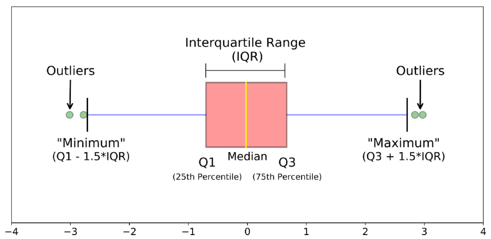
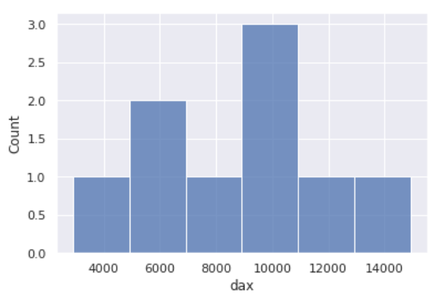
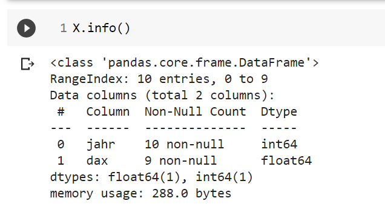

# Fehlerarten

## Grundsätzliche Fehlerarten

### Stochastische Fehler

Quellen: Messtechnisch nicht erfassbare Änderungen der Maßkörper, der Messgeräte, des Messgegenstandes, der Umwelt und der Beobachter hervorgerufen:

* Ablesefehler
* Tippfehler
* mangelnde Kalibrierung

(Auch numerische Berechnungen, z.B. mit einem Computer, sind in der Regel nicht beliebig genau, sondern fehlerhaft.)

Quelle: [AT-6.pdf (tu-dresden.de)](https://tu-dresden.de/bu/umwelt/hydro/iak/ressourcen/dateien/systemanalyse/studium/folder-2009-01-29-lehre/folder-2009-04-03-at/AT-6.pdf?lang=de)

Modellierung durch _additive noise_.

### Systematische Fehler

Systematische Fehler: werden hauptsächlich durch Unvollkommenheiten der Maßverkörperung der Messgeräte, der Messverfahren und des Messgegenstandes sowie von messtechnisch erfassbaren Einflüssen der Umwelt und persönlichen Einflüssen der Beobachter hervorgerufen. Sie haben

* falsche Formeln
* falsches Vorzeichen (+ oder -)
* unter gleichen Bedingungen den gleichen Betrag, d.h. sie können durch Wiederholung der Messung nicht festgestellt werden, sondern nur durch ein anderes (genaueres) Messgerät oder Messverfahren

Quelle: [AT-6.pdf (tu-dresden.de)](https://tu-dresden.de/bu/umwelt/hydro/iak/ressourcen/dateien/systemanalyse/studium/folder-2009-01-29-lehre/folder-2009-04-03-at/AT-6.pdf?lang=de)

## Beispiele

### Outliers und Boxplots

Link: https://towardsdatascience.com/understanding-boxplots-5e2df7bcbd51 



Vertiefung:

[Outliers, Inliers, and Other Surprises that Fly from your Data | Rocket-Powered Data Science (rocketdatascience.org)](http://rocketdatascience.org/?p=473)

### Inliers und Drift


### Missing Data or Invalid Data

Hier handelt es sich um fehlende Daten, z.B. leere oder ungültige Zellen in Excel-Files. Was tun?

Möglichkeiten zum Umgang:

- *invalidity list*
- *invalidity value*
- *correction / estimation*; Examples:
  - *mean, median, minimum, maximum*
  - *nearest neighbor*
  - *lineare interpolation*
- *removal of feature vektor*
- *removal of feature*

&#x20;

## Python: Fehler/"Verdächtige"  finden

In diesem und den folgenden Abschnitte arbeiten wir mit folgendem dem Dataframe X. Dieser sollte immer erzeugt sein, sonst funktionieren die weiterten Beispiele nicht.

```
import pandas as pd
import numpy as np

X = pd.DataFrame({
   "jahr": [2010, 2011, 2012, 2013, 2014, 2015, 2016, 2017, 2018, 2019],
    "dax": [6914.19, 5898.35, 7612.39, 9552.16, 9805.55, np.nan, 11481.06, 2917.64, 10558.96, 13249.01] 
   })
```


### Überblick verschaffen: `describe` und `info`

Für unsere Feature-Matrix gibt es zwei Python Befehle, die wir zum Start grundsätzlich durchführen:

```
X.describe()
X.info()
```

### Histogramme mit Seaborn

Lesen sie zu Seaborn durch https://seaborn.pydata.org/ und stöbern Sie durch die "Gallery".

Wir erzeugen ein Histogramm mit folgenden Zeilen:

```python
import matplotlib.pyplot as plt
import seaborn as sns

sns.set()
sns.histplot( X, 
             x ="dax", 
             binwidth=2000,
             kde = False)
plt.show()
```

Ergebnis:



### Missing Values (`null`-Values, `na`-Values)

Link: https://www.bmc.com/blogs/pandas-nan-missing-data/

Der Aufruf `X.info()` sagt uns, dass nicht zu jeder Spalte alle Daten gefüllt sind.



Folgender Befehl löscht alle Zeilen mit na-Werten aus dem Dataframe:

```python
XC = X.dropna()
```


### Outliers and Boxplots

Wir verwenden zunächst Boxplots ([https://seaborn.pydata.org/generated/seaborn.boxplot.html](https://seaborn.pydata.org/generated/seaborn.boxplot.html))&#x20;

```
import seaborn as sns
sns.boxplot(x = X["dax"])
X.describe()
```

### Übung  1 zu Boxplots

Die Definition von Quartilen ist nicht eindeutig. Finden Sie anhand des folgenden Dataframes (und leichten Modifikationen) heraus, wie Seaborn die Quartile berechnet.

```
import matplotlib.pyplot as plt

T = pd.DataFrame({
   "data": [1,2,3,4,5,6,7,8,9,10,11]
   }
  )
sns.boxplot(x = T["data"])
T.describe()
```

### Übung 2 zu Boxplots

Folgendes Beispiel zeigt, dass bei mehrfach auftretenden Werten Vorsicht geboten ist.

```
import seaborn as sns
T = pd.DataFrame({
   "data": [1, 1, 1, 5, 5, 5, 5, 5, 5, 5]
   })
sns.boxplot(x = T["data"])
T.describe()
```
