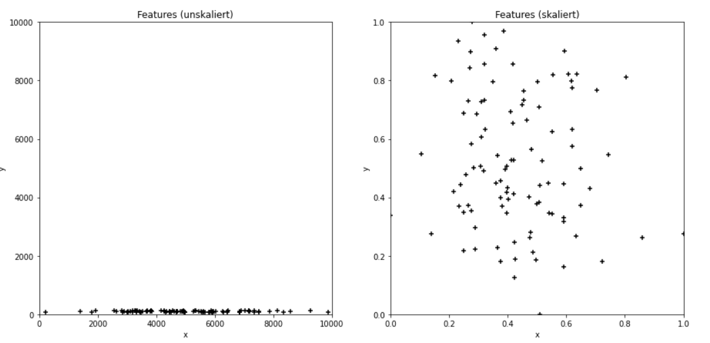

# Datentransformation

## Standardisierung (Feature Scaling)

Ziel: Vermeiden extrem unterschiedlicher Wertebereiche verschiedener Features.

Beispiel:

Nehmen wir an, dass in einem Datensatz mit zwei Features 

- das erste Feature $$x$$ einer Normalverteilung von mit $$\mu=5000,\sigma=2000$$ entspricht
- das zweite Feature  $$y$$ einer Normalverteilung von mit $$\mu=100,\sigma=20$$ entspricht

Dies kann für numerische Verfahren erhebliche Probeme bereiten. In vielen Fällen macht es Sinn metrische Features wie folgt in den Bereich von [0,1] zu skalieren:
$$
x_k = \frac{x_k - x_{min}}{x_{max} - x_{min}}
$$
Verfährt man für das zweite Feature y analog, so sieht Plot für skalierte und und unskalierte Daten wie folgt aus:




## One-Hot Encoding

One-Hot-Encoding ist eine Methode, um kategorische Daten als binäre Vektoren darzustellen. Folgende Grafik verdeutlicht die Methode und illustriert den Namen. 

.png>)

One-Hot-Encoding funktioniert in folgenden beiden Schritten:

1. Extrahiere aus einem Feature die auftretenden Kategorie-Werte
2. Transformiere den/die Kategorie-Wert/e in einen Vektor.

Glücklicherweise gibt es einen Funktion in `sklearn`, die das für uns erledigt. Folgender Code sollte einfach zu verstehen sein.

```python
import pandas as pd
from sklearn.preprocessing import OneHotEncoder

x = [['A'], ['B'], ['A'], ['X'],['X'],['Z'],['A']]

enc = OneHotEncoder(sparse=False)
enc.fit( x )
print("\nKategorien: \n", enc.categories_)

# Transformieren eines Wertes
print("\nOne-Hot-Encoding von A : \n", enc.transform( [['A']] ) )

# Transformieren des  Arrays embarked
print("\nOne-Hot-Encoding von x : \n", enc.transform( x ) )
```

Ausgabe: 

.png>)

