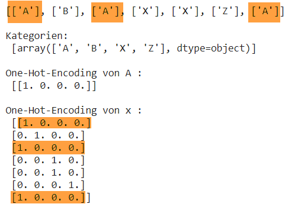

# Datentransformation

## Standardisierung (Feature Scaling)

Ziel: Vermeiden extrem unterschiedlicher Wertebereiche verschiedener Features.

Beispiel: Nehmen wir an, dass in einem Datensatz mit zwei Features 

- das erste Feature $$x$$ einer Normalverteilung von mit $$\mu=5000,\sigma=2000$$ entspricht
- das zweite Feature  $$y$$ einer Normalverteilung von mit $$\mu=100,\sigma=20$$ entspricht

Dies kann für numerische Verfahren erhebliche Probeme bereiten. In vielen Fällen macht es Sinn metrische Features wie folgt in den Bereich von [0,1] zu skalieren:
$$
x_k = \frac{x_k - x_{min}}{x_{max} - x_{min}}
$$
Verfährt man für das zweite Feature y analog, so sieht Plot für skalierte und und unskalierte Daten wie folgt aus:


### Python-Code

```python
import numpy as np
import matplotlib.pyplot as plt

N = 100
x = np.random.normal(5000, 2000, N)
y = np.random.normal(100, 20, N)

fig, ax = plt.subplots(1,2, figsize=(15,7))
ax[0].set_xlim(0,10000)
ax[0].set_ylim(0,10000)
ax[0].set_aspect('equal')
ax[0].set_xlabel('x')
ax[0].set_ylabel('y')
ax[0].set_title('Features (unskaliert)')
ax[0].scatter(x, y, marker='+', color='black')
ax[1].set_xlim(0,1)
ax[1].set_ylim(0,1)
ax[1].set_aspect('equal')
ax[1].set_xlabel('x')
ax[1].set_ylabel('y')
ax[1].set_title('Features (skaliert)')
ax[1].scatter((x - x.min())/(x.max()-x.min()), (y - y.min())/(y.max()-y.min()), marker='+', color='black')

plt.show()
print(f"x-min/mean/x_max = {x.min()} / {x.mean()}/ {x.max()}")
print(f"y-min/mean/y_max = {y.min()} / {y.mean()} / {y.max()}")
```


## One-Hot Encoding

One-Hot-Encoding ist eine Methode, um kategorische Daten als binäre Vektoren darzustellen. Folgende Grafik verdeutlicht die Methode und illustriert den Namen. 



One-Hot-Encoding funktioniert in folgenden beiden Schritten:

1. Extrahiere aus einem Feature die auftretenden Kategorie-Werte
2. Transformiere den/die Kategorie-Wert/e in einen Vektor.

### Python-Code

Glücklicherweise gibt es einen Funktion in `sklearn`, die das für uns erledigt. Folgender Code sollte einfach zu verstehen sein.

```python
import pandas as pd
from sklearn.preprocessing import OneHotEncoder

x = [['A'], ['B'], ['A'], ['X'],['X'],['Z'],['A']]

enc = OneHotEncoder(sparse=False)
enc.fit( x )
print("\nKategorien: \n", enc.categories_)
print("\nOne-Hot-Encoding von A : \n", enc.transform( [['A']] ) )
print("\nOne-Hot-Encoding von x : \n", enc.transform( x ) )
```


