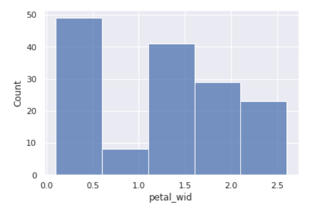
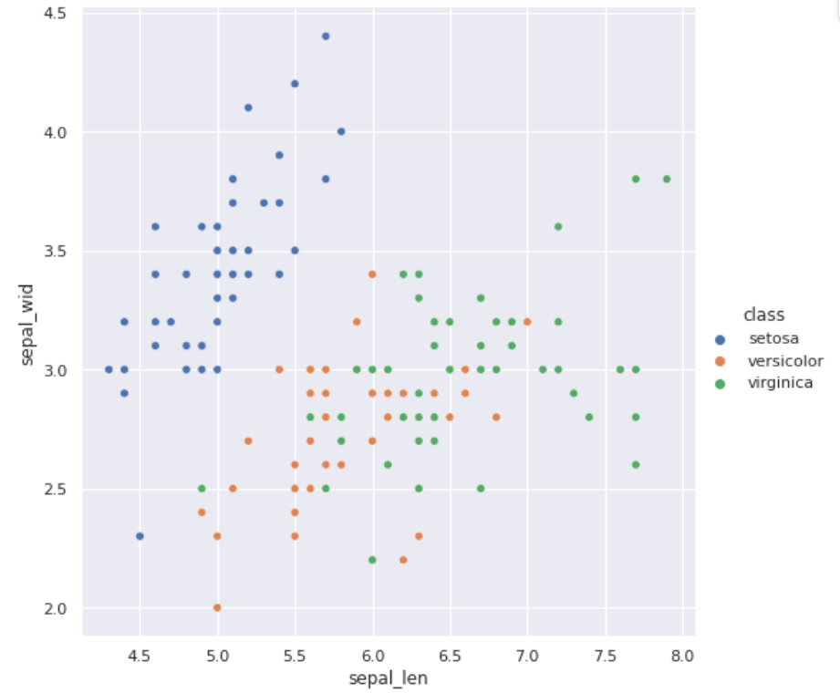
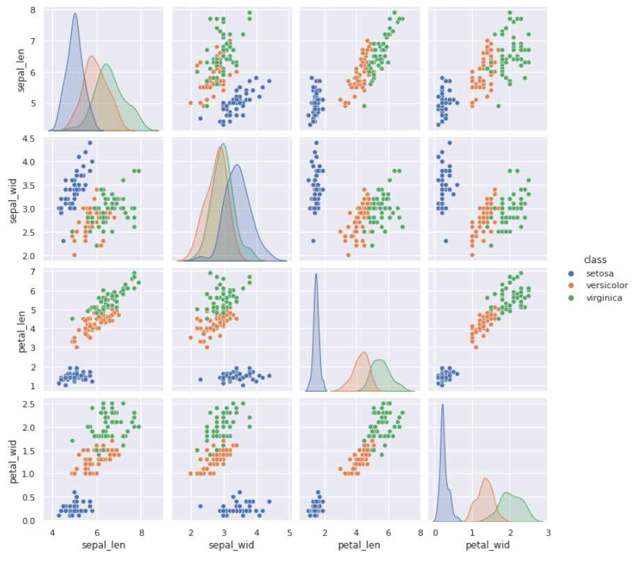

# Visualisierung

In vielen Fällen hilft uns eine Visualisierung von Daten bei der Analyse und kann uns den Weg für die nächsten Verarbeitungsschritte weisen. Wie nutzen das Paket `seaborn`. 

Wir arbeiten in diesem Abschnitt mit dem Iris-Datensatz. Achten Sie bitte darauf, dass er geladen ist. Hier nochmals der Code.

```python
import pandas as pd

iris = datasets.load_iris()
iris_df = pd.DataFrame(iris.data)
iris_df['class']=iris.target_names[iris.target ]
iris_df.columns=['sepal_len', 'sepal_wid', 'petal_len', 'petal_wid', 'class']
```


## Histogramm-Plots

```
import matplotlib.pyplot as plt
import seaborn as sns

sns.set()

sns.histplot( iris_df, 
             x ="petal_wid", 
             binwidth=0.5,
             kde = False)
plt.show()
```



## Relational Plots

Mit *relational plots* können wir abschätzen, in welchem Umfang uns features zur Ermittlung des lables helfen. Nachfolgende Grafik zeigt einen recht spannenden Zusammenhang von sepal_wid und sepal_len mit dem  Label.



```
sns.relplot(data=iris_df, x="sepal_len", y="sepal_wid", hue = "class", height=8)
```

## Pairplots



#### Python

```
sns.set()
sns.pairplot(iris_df[['sepal_len', 'sepal_wid', 'petal_len', 'petal_wid', 'class']],
             hue="class", diag_kind="kde")
```

