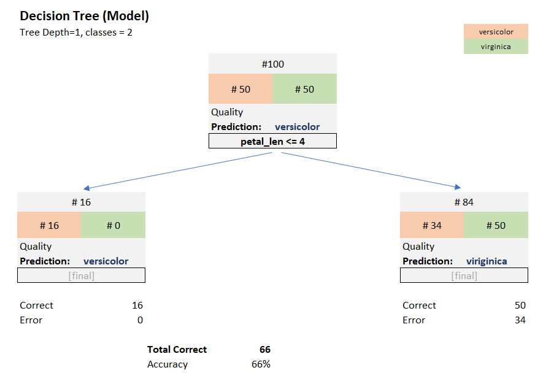
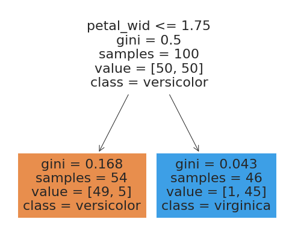
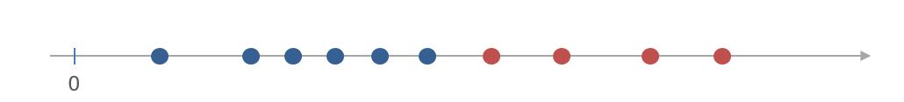

# Grundidee

Wir versuchen einen als Modell einen Entscheidungsbaum zu konstruieren, der entlang von Werten eines Feature aufgebaut ist.  Der letzte Knoten jedes Pfades gibt die zugeordnete Klasse an. 

## Beispiel

Zur Vereinfachung wählen wir im folgenen Beispiel nur *versicolor*- und *viriginica*-Datensätze aus, arbeiten also mit zwei Klassen und 100 Datensätzen.

Ein möglicher Entscheidungsbaum sieht dann so aus:




Jeder Knoten beschreibt (in Klammern die Werte für den obersten Knoten, auch Wurzel/Root genannt):

- die gesamte Anzahl der Datensätze, die in den Knoten fließen (#100)
- die Aufteilung der Datensätze in einzelne Klassen (#50 / #50)
- die Qualität des Knotens (dazu später mehr)
- für Blätter: die Prediction, die für Datensätze dieses Block getroffen wird (hier *versicolor* - warum??). 
- das Kriterium für die weitere Aufspaltung

Bitte beachten:

- In einem Knoten darf nur *ein* *Feature* mit einer Vergleichsoperation abgefragt werden
- Die Baumhöhe ist definiert durch: Anzahl der Knotenebenen unter dem Wurzelknoten (in obigem Baum 1).
- Die Modellfamilie ist die Menge aller Bäume einer bestimmten Höhe.


Sie können die Zahlen aus obigem Entscheidungsbaum mit Excel nachvollziehen oder - schneller - mit folgenden kleinen Programmen berechnen.


## Python

### Auswahl von versicolor und virginica

Die letzte Zeile ist entscheidend. Der Rest unterscheidet sich nicht vom bereits bekannten Ladevorgang.

```python
import pandas as pd
from sklearn import datasets

iris = datasets.load_iris()
iris_df = pd.DataFrame(iris.data)
iris_df['class']=iris.target_names[iris.target ]
iris_df.columns=['sepal_len', 'sepal_wid', 'petal_len', 'petal_wid', 'class']
iris_df = iris_df[50:]
```

### "Manuelle Abfrage" von Werten

```python
filter_crit = (iris_df["petal_len"] <= 4)
filter_ver  = (iris_df["class"] == "versicolor")
filter_vir  = (iris_df["class"] == "virginica")


print( "Total      : ", iris_df[ filter_crit]["class"].count() )
print( "Versicolor : ", iris_df[ filter_crit & filter_ver]["class"].count() )
print( "Virginica  : ", iris_df[ filter_crit & filter_vir]["class"].count() )
```


# Berechnung des optimalen Baums 

Unsere Modellfamilie ist nun die Menge aller Bäume der Höhe zwei und wir versuchen den besten Baum im Sinne der *Accuracy* zu finden. Dazu hilft uns Python:



## Übung

1. Berechnen sie die Werte in den Knoten mit dem Phython-Programm aus dem vorhergehenden Abschnitt.
2. Welche *Accuracy* hat dieser Baum?


## Python

```python

X = iris_df.sample(frac=1).reset_index(drop=True)
y = X['class']
X = X.drop(['class'], axis=1)

print(f'\nShape of Feature Matrix : {X.shape}')
print(f'\nShape of Labels : {X.shape}')

clf = DecisionTreeClassifier(random_state=1234, criterion = 'gini', max_depth=1)
model = clf.fit(X, y)

fig = plt.figure(figsize=(8,8))
p = tree.plot_tree(clf
                   , feature_names=X.columns
                   , class_names=['versicolor', 'virginica']
                   , filled=True
                   )
```


# Qualität eines Knotens 

Jeder Knoten eines Entscheidungsbaums enthält eine Aufteilung seiner Daten in zwei Gruppen.


Sie sehen oben zwei mögliche Entscheidungsbäume für Iris mit unterschiedlicher Accuracy. Offensichtlich hängt die Accuracy von der Entscheidung am Wurzelknoten ab. Diese Entscheidung erzeugt zwei Teilmengen  mit 54 Elementen im linken Knoten und 46 Elemente im rechten Knoten. 


## Gini-Impurity

Nehmen Sie an, dass eine Menge S  in Teilmengen $$S_1, S_2,...S_k$$  zerlegt wird (und damit den Elementen einer Teilmengen jeweils ein Label zugeordnet ist.) Mit  $$p_i$$  bezeichnen wir jeweils das Verhältnis der Elemente  von $$S_i$$ im Vergleich zu $$S$$. Wegen $$\sum p_i = 1$$ definiert$$(p_1, p_2, ... p_n)$$ eine (diskrete) Verteilungsfunktion. 

Wir wählen nun aus Menge $$S$$  zufällig  Elemente aus Für jedes gewählte Element raten wir, zu welcher Teilmenge es gehört. Beim Raten halten wir die obige Verteilungsfunktion ein. Wie hoch ist die Wahrscheinlichkeit - die wir im folgenden GINI nennen - , dass wir falsch raten?

Offensichtlich ist für $$k=2$$:
$$
\begin{align}
\text{GINI} 
& = p_1 \cdot (1-p_1) + p_2 \cdot (1-p_2) \\
& = 2 p_1 p_2\\
& = 1 - p_1^2 - p_2^2
\end{align}
$$
wegen $$1 = (p_1 + p_2)^2 = p_1^2 + 2p_1p_2 + p_2^2$$

## Beispiel




Besteht eine Menge aus $$n$$​ Klassen jeweils   $$S_L$$ und $$S_R$$  die gemäß der Bedingung jeweils in den linken und rechten Knoten fließen. 
