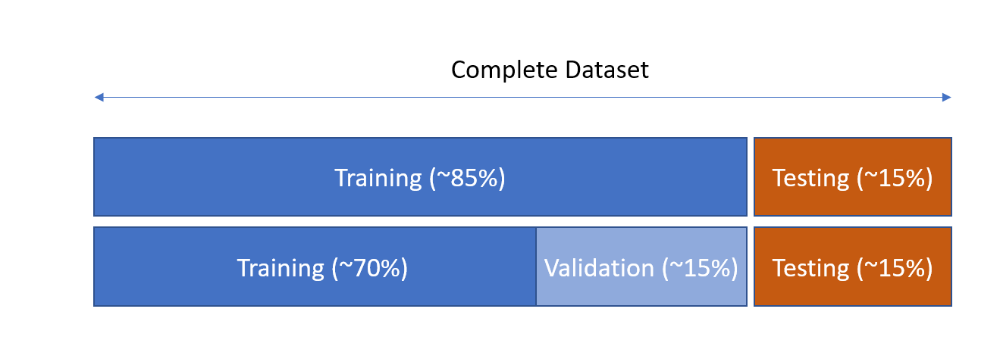
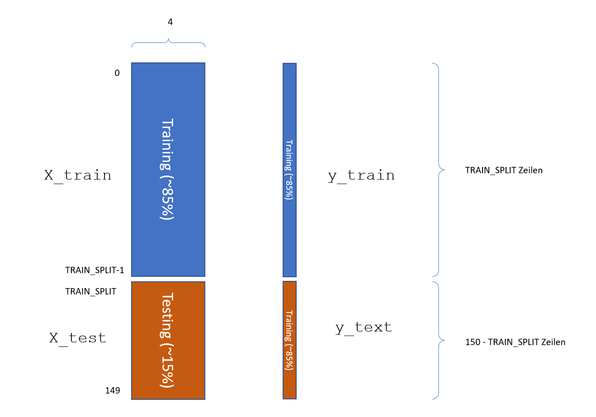
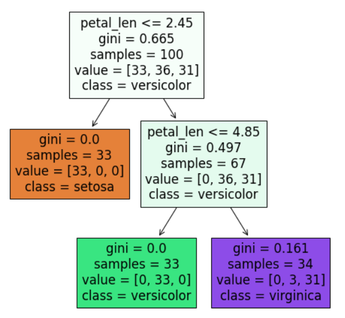

## Aufteilung in Training-Set und Test-Set

Wir teilen unseren Datensatz in einen Trainings-Teil und einen Test-Teil auf (Wir ignorieren für den Moment den Validation Set.)



| Menge       | Beschreibung                                                 |
| ----------- | ------------------------------------------------------------ |
| X_train     | Dataframe mit Feature-Vektoren der Trainings-Set             |
| y_train     | Dataframe mit Label-Vektor des Trainings-Sets                |
| X_test      | Dataframe mit Feature-Vektoren der Test-Sets                 |
| y_test      | Dataframe mit Label-Vektor des Trainings-Sets                |
| TRAIN_SPLIT | Anzahl der Examples im Training-Set, der Rest geht zum Test-Set |


## Iris-Decison-Tree mit Train/Test-Set

### Aufteilung in Training- und Test-Set

Wir nutzen hier noch keine Validierung. Die Variable TRAIN_SPLIT enthält die Anzahl der Examples aus dem Training-Set.

```python
import pandas as pd

from matplotlib import pyplot as plt
import seaborn as sns

from sklearn import datasets
from sklearn.tree import DecisionTreeClassifier 
from sklearn import tree

iris = datasets.load_iris()
iris_df = pd.DataFrame(iris.data)
iris_df['class']=iris.target
iris_df.columns=['sepal_len', 'sepal_wid', 'petal_len', 'petal_wid', 'class']

X = iris_df.sample(frac=1).reset_index(drop=True)

TRAIN_SPLIT = 100
X_train = X[0:TRAIN_SPLIT]
y_train = X_train['class']
X_train = X_train.drop(['class'], axis=1)
print( X_train.head())

X_test = X[TRAIN_SPLIT:]
y_test = X_test['class']
X_test = X_test.drop(['class'], axis=1)

print(f'\nShape of Training-Data : {X_train.shape}')
print(f'\nShape of Test-Data     : {X_test.shape}')

```


#### Erläuterung:



### Entscheidungsbaum erzeugen

Ergänzen Sie diesen Code direkt unter den obigen Zeilen.

```python
clf = DecisionTreeClassifier(random_state=1234, criterion = 'gini', max_depth=2)
model = clf.fit(X_train, y_train)

print("Accuracy-Training : ", clf.score(X_train, y_train))
print("Accuracy-Testing  : ", clf.score(X_test, y_test))

print("Creating Tree ... ")
fig = plt.figure(figsize=(8,8))
p = tree.plot_tree(clf
                   , feature_names=X.columns
                   , class_names=['setosa', 'versicolor', 'virginica']
                   , filled=True
                   )
```


Ergibt folgenden optimalen Baum für TRAIN_SPLIT = 100 den optimalen Baum (der Höhe 1):




### Einzelne Prediction

Wir wollen nun einen einzelnen Datensatz vorhersagen und mit den Trainingsdaten vergleichen:

```python
y_pred = model.predict( X_train.iloc[i:i+1])[0]    
```

Erläuterung: Mit` X_train.iloc[i:i+1]` wählen wir die i-te Zeile in der Feature-Matrix `X_train` aus.


### Manuelle Berechnung der Accuracy

```python
N = X_train.shape[0]
y_pred = model.predict( X_train )
check_vector = y_pred==y_train
c = check_vector.sum()
print(check_vector[0:10])
print("Accuracy (manuell) ..: ", c/N)
```


