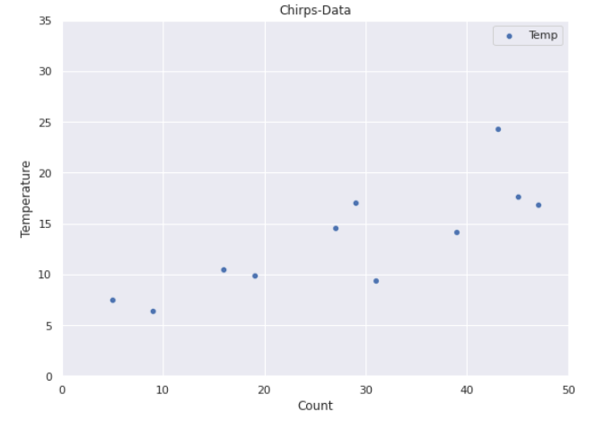
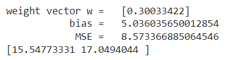
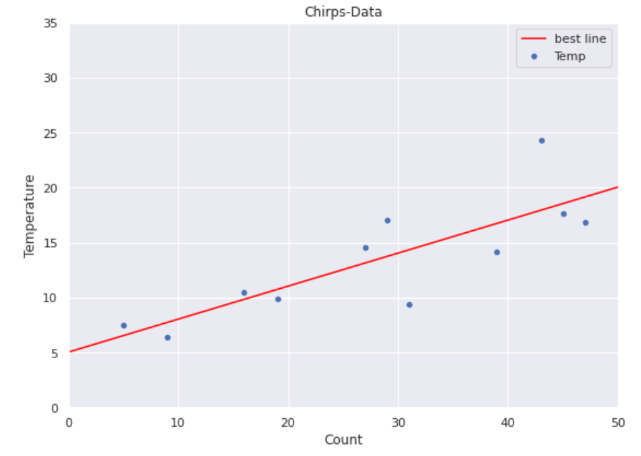

Anhand des Zirpens von Grillen kann man mehr oder weniger verlässlich die Lufttemperatur berechnen. Die Körperfunktionen von Grillen verändert sich wie bei anderen Insekten auch durch veränderte Lufttemperatur.  Wie alle Insekten sind Grillen kaltblütig und nehmen die sie umgebende Temperatur an. Je wärmer, desto häufigeres Zirpen, denn: Ist es wärmer, laufen die Körperfunktionen – wie auch Bewegungen – schneller ab, die Grillen sind aktiver. \[…] Da Grillen also bei erhöhter Temperatur häufiger Zirpen, kann man aus der Häufigkeit des Zirpens die Lufttemperatur ableiten. Die Formel dafür ist sehr simpel. Um die Temperatur in Grad Celsius zu errechnen, zählt man das Zirpen einer einzelnen Grille in einem Intervall von 25 Sekunden. ([Quelle](https://www.heute.at/s/so-verraten-ihnen-grillen-die-aktuelle-temperatur-54218483))

# Dataset

Nehmen wir an, dass folgende kleine Menge von labelled examples vorliegt: 

.png>)

Natürlich wollen wir nun - wie üblich - aus dem feature den label vorhersagen. Offensichtlich handelt es sich um ein Regressionsproblem. Nachfolgendes Bild visualisiert die Daten:



# Phython

```python
from matplotlib import pyplot as plt
import seaborn as sns


import pandas as pd
import numpy as np

chirps = pd.DataFrame({
    "Count": [31,16,29,43,27,19,47,9,45,5,39],
    "Temp": [9.4,10.5,17.1,24.3,14.6,9.9,16.9,6.4,17.7,7.5,14.2]    
})


fig,ax = plt.subplots(figsize=(9, 9))
ax.set_aspect('equal')
ax.set_title("Chirps-Data") 
ax.set_xlabel("Count")
ax.set_ylabel("Temperature")

ax.set_xlim(0, 50)
ax.set_ylim(0, 35)

sns.set()
sns.scatterplot(data = chirps, x = "Count", y="Temp", label="Temp")
```


# Modellfamilie

Unsere Modellfamilie sind die linearen Funktionen  $$M_{w,b} : \mathbb{R} \rightarrow   \mathbb{R}$$, definiert durch

$$
M_{w,b}(x) = x \cdot w +b
$$

Wir suchen also $$w$$ und $$b$$  in $$\mathbb{R}$$, so dass unser dadurch definiertes Modell unseren Datensatz möglichst gut vorhersagt. Offenbar ist M für fest gewähltes w und b eine lineare Funktion, die wir gut visualisieren können.


## Übung

Geben sie eine visuelle Abschätzung für Gewicht und Bias


# Fehlerfunktion (Loss)

Um die Qualität eines gewählten Modells zu verwenden verwenden wir den schon bekannten  MSE:

$$
MSE(w,b) = \frac{1}{n}\sum_{i=0}^{n-1} (M_{w,b}(x_i) -y_i) ^2
$$

für alle $$n$$ labelled examples$$(x_i,y_i)$$ aus dem Dataset. Durch Einsetzen der Definition von $$M$$ ergibt sich nun:

$$
\begin{align*}
MSE(w,b)
    &= \frac{1}{n}\sum_{i=0}^{n-1} ( x_i\cdot w + b - y_i ) ^2
\end{align*}
$$


# Visualisierung der Fehlerfunktion

Der MSE ist eine reelle Zahl, die von w und b abhängt.  Wir können daher den MSE-Graph als Fläche über der Weight-Bias Eben plotten. Der Pfeil zeigt auf den Wert von $$w$$ und $$b$$, an dem wir das Minimum der Fehlerfunktion erwarten.


Am tiefsten Punkt der Fläche haben wir das beste Modell gefunden. Der kleine Punkt in der Grafik markiert in etwa diesen Punkt. Aber wir kommen wir dorthin?


# Gradientenabstieg (_gradient descent_)

Wir haben eben gesehen, dass die Fehlerfunktion MSE nur von w und b abhängt. Das Minimum von Funktionen lässt sich unter bestimmten Umständen, so wie in diesem Beispiel,  durch die erste Ableitung berechnen. In der Praxis gelingt das aber nur selten. Erfolgversprechender ist das sukzessive Absteigen  auf der Fläche. Da unserer Fehlerfunktion differenzierbar ist, ist der negative Gradient die beste Abstiegsrichtung. In folgender Abbildung ist zur Verdeutlichung ein willkürlicher "Abstiegspfad" eingezeichnet:

.png>)

  


# Optimales Modell mit Python

Wir können die optimalen Paramater einfach berechnen lassen. Das Ergebnis ist: 



Übrigens lässt sich das auch analytisch berechnen. Sie können das hier nachlesen.


## Python

Wir erzeugen zunächst die recht einfache Feature Matrix $$X \in \mathbb{R}^{11 \times 1}$$ und den Label-Vektor $$y\in \mathbb{R}^{11}$$ 

```python
import pandas as pd
import numpy as np

from matplotlib import pyplot as plt
import seaborn as sns

from sklearn.linear_model import LinearRegression

chirps = pd.DataFrame({
    "Count": [31,16,29,43,27,19,47,9,45,5,39],
    "Temp": [9.4,10.5,17.1,24.3,14.6,9.9,16.9,6.4,17.7,7.5,14.2]    
})

# Ceate (11,1) Feature Matrix
X = chirps["Count"].to_numpy().reshape(11,-1)

# Ceate (11,) Label-Vektor
y = chirps["Temp"].to_numpy() 

# Phase 1. Trainingsphase
reg = LinearRegression().fit(X, y)
print("weight vector   w =  ", reg.coef_ )
print("intercept value b =  ", reg.intercept_)

#Phase 2: Produktivphase
y_pred = reg.predict(X)
print("              MSE =  ", ((y-y_pred)*(y-y_pred)).sum()/11 )

#Make a prediction for nbs data
print( reg.predict( np.array([35,40]).reshape(-1,1)  ))   
```


# Visualisierung des optimalen Modells


Folgende Abbildung zeigt das optimale Modell:



## Python

```python
import pandas as pd
import numpy as np

from matplotlib import pyplot as plt
import seaborn as sns

from sklearn.linear_model import LinearRegression

chirps = pd.DataFrame({
    "Count": [31,16,29,43,27,19,47,9,45,5,39],
    "Temp": [9.4,10.5,17.1,24.3,14.6,9.9,16.9,6.4,17.7,7.5,14.2]    
})

# Ceate (11,1) Feature Matrix
X = chirps["Count"].to_numpy().reshape(11,-1)

# Ceate (11,) Label-Vektor
y = chirps["Temp"].to_numpy() 

w = reg.coef_[0] 
b = reg.intercept_

x_values = np.array([0, 50])
y_values = np.array([b, 50*w + b])

sns.set()
fig,ax = plt.subplots(figsize=(9, 9))
ax.set_aspect('equal')
ax.set_title("Chirps-Data") 
ax.set_xlabel("Count")
ax.set_ylabel("Temperature")
ax.set_xlim(0, 50)
ax.set_ylim(0, 35)

sns.scatterplot(data = chirps, x = "Count", y="Temp", label="Temp")
sns.scatterplot( x = X.reshape(-1,), y= reg.predict(X).reshape(-1,), label="Predictions")
sns.lineplot(x=x_values,y=y_values, color="red", label="best line xw+b")
```

