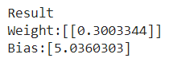

Anhand des Zirpens von Grillen kann man mehr oder weniger verlässlich die Lufttemperatur berechnen. Die Körperfunktionen von Grillen verändern sich wie bei anderen Insekten auch durch veränderte Lufttemperatur. Denn wie alle Insekten sind Grillen kaltblütig und nehmen die sie umgebende Temperatur an. Je wärmer, desto häufigeres Zirpen. Ist es wärmer, laufen die Körperfunktionen – wie auch Bewegungen – schneller ab, die Grillen sind aktiver. \[…] Da Grillen also bei erhöhter Temperatur häufiger Zirpen, kann man aus der Häufigkeit des Zirpens die Lufttemperatur ableiten. Die Formel dafür ist sehr simpel. Um die Temperatur in Grad Celsius zu errechnen, zählt man das Zirpen einer einzelnen Grille in einem Intervall von 25 Sekunden.

### Dataset

Nehmen wir an, dass folgende kleine Menge von labelled examples vorliegt: 

.png>)

Natürlich wollen wir nun - wie üblich - aus dem feature den label vorhersagen. Offensichtlich handelt es sich um ein Regressionsproblem. 

Mit folgendem Code definieren wir unseren Dataset:

```python
df = pd.DataFrame({
    "Count": [31,16,29,43,27,19,47,9,45,5,39],
    "Temp": [9.4,10.5,17.1,24.3,14.6,9.9,16.9,6.4,17.7,7.5,14.2]   
})
```


### Das "Grillen-Neuron"

Wenn wir ein Neuron mit _einem _Eingabewert und _linearer Activation_ bauen, so ist die Ausgabe des Neurons

$$
y = M(x) = x \cdot w +b
$$

Wir suchen also $$w$$ und $$b$$  in $$\mathbb{R}$$, so dass unser dadurch definiertes Modell unseren Datensatz möglichst gut vorhersagt. Offenbar ist M für fest gewähltes w und b eine lineare Funktion, die wir gut visualisieren können.


### Neuronales Netz und Learning

Folgender Code erzeugt die Modellfamilie und berechnet dann das optimale Modell:

```python
from tensorflow.keras.models import Sequential
from tensorflow.keras.layers import Dense, Activation
from tensorflow.keras import optimizers

#Create Neural Netwotk
model = Sequential()
model.add( Dense(1, activation='linear') )
model.compile(loss='mean_squared_error', optimizer='adam')


# Run the training
history = model.fit(X,y, verbose=0, epochs=20000)

print("Result")
[weight, bias] = model.layers[0].get_weights();
print(f'Weight:{weight}')
print(f'Bias:{bias}')
```

(Mögliche) Ausgabe: 



###  Visualisierung des gelernten Modells

Folgende Grafik visualisiert das Geschehen bisher:

* Die roten Punkte zeigen die _labelled examples_
* Die blauen Punkte zeigen die _predictions _für die features
* Die blaue Linie visualisiert das Modell 

.png>)

### Visualisierung der Fehlerfunktion

Der MSE ist eine reelle Zahl, die von w und b abhängt.  Wir können daher den MSE-Graph als Fläche über der Weight-Bias Eben plotten. 

.png>)

Am tiefsten Punkt der Fläche haben wir das beste Modell gefunden. Der kleine Punkt in der Grafik markiert in etwa diesen Punkt.

### Gradientenabstieg (_gradient descent_)

Wir haben eben gesehen, dass die Fehlerfunktion MSE nur von w und b abhängt. Das Minimum von Funktionen lässt sich unter bestimmten Umständen durch die erste Ableitung berechnen. In der Praxis gelingt das aber nur selten. Erfolgversprechender ist das sukzessive Absteigen  auf der Fläche. Da unserer Fehlerfunktion differenzierbar ist, ist der negative Gradient die beste Abstiegsrichtung.

In folgender Abbildung ist ein willkürlicher "Abstiegspfad" eingezeichnet:

  

-16393293673732.png)

Der Abstiegsverfahren lässt sich etwas besser anhand eines Grafen einer Loss-Funktion $$L: \mathbb{R} \rightarrow \mathbb{R}$$ veranschaulichen. Es wir dabei angenommen, dass der Loss (auch "Cost") nur von $$w$$ abhängt.  


.png)

Ist L differenzierbar und  $$L´(x_0) < 0$$ für einen zufällig gewählten Startwert $$x_0$$ , so gilt wegen

$$
L´(x_0) = \lim_{h \rightarrow 0} \frac{f(x_0+h) - f(x_0)}{h}  <0
$$

für hinreichend kleines $$h_0 > 0$$:

$$
\frac{f(x_0+h_0) - f(x_0)}{h_0}  <0
$$

und damit

$$
f(x_0+h_0) < f(x_0)
$$

Nun setzt man $$x_1 = x_0 + h_0$$ und fährt weiter fort. 


### Trainingsschritt und Epochen

Ein **Trainingsschritt **(learning-step) ist eine neue Festlegung der Parameter eines Modells, so dass der Loss kleiner wird. Diese neue Festlegung funktioniert auf der Basis des Gradienten der Loss-Funktion. In obigem Beispiel wäre der Trainingsschritt $$h_0.$$ Eine **Epoche **ist ein Trainingsschritt auf der Grundlage aller Trainingsdaten. Wir identifizieren für den Moment eine Epoche mit einem Abstiegsschritt.

### Visualisierung des Lernfortschritts

.png>)

