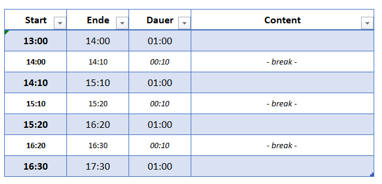
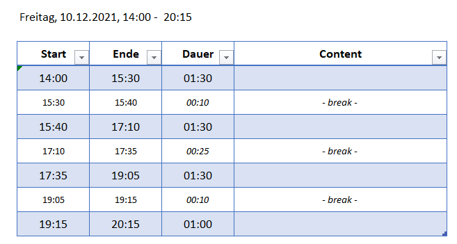

# An der Startlinie 

## Skript

- Die folgende Youtube-Playlist kann zur Vertiefung einzelner Stoffteile nutzen: [Youtube Playlist](https://youtube.com/playlist?list=PLfGN40VwjduJPvtP9QUjC0rjM6-ePT9bg)
- Wenige Passagen in diesem Skript sind eventuell in englischer Sprache gehalten.
- Dieses Skript 
  - befindet sich in Teilen im Aufbau, leichte Fehler sind also möglich (und wahrscheinlich  - für Hinweise bin ich dankbar)
  - geht nach der Prüfung off-line

## Google Konto

Sie brauchen ein Google-Konto für die Nutzung von Colab und ggf. für das Laden von Dateien  von  Google Drive. 

## Colab

Für unsere praktischen Aktivitäten nutzen wir die [Colab-Notebooks](https://colab.research.google.com/). 

## Programmierkenntnisse

Programmierkenntnisse sind nicht erforderlich. Sie werden das Nötige  im Kurs lernen.

## Mathematik

Wir benötigen folgende Grundlagen, die ich aber kurz wiederholen werde:

- Verteilung, Gleichverteilung, Normalverteilung, Erwartungswert, Standardabweichung, Modus, Median
- Vektor, Matrix, Skalarprodukt
- Funktionen, speziell lineare Abbildungen

# Teaching-Flow & Agenda

Wir springen etwas zwischen den Kapiteln, um die inhaltlichen Kapitel (A,B) nicht mit den Phython-Grundlagen (C) zu vermischen.

Link zu den in der jeweiligen Terminen erzeugten [Colab-Notebooks](https://github.com/Prof-Greipl/dsml-duf)

## 11.12.2012, 13:00 - 17:30 Uhr

[C2. Elementweise Operationen](https://the-technology-lab.gitbook.io/dsml-master-duf/S0aldZCOg4S1HudPOP87/py/numpy#elementweise-operationen)  und [C.2 Numpy - Matrix](https://the-technology-lab.gitbook.io/dsml-master-duf/S0aldZCOg4S1HudPOP87/py/numpy#matrix) 

[C.3 Pandas und Dataframes](https://the-technology-lab.gitbook.io/dsml-master-duf/S0aldZCOg4S1HudPOP87/py/pandas-und-dataframes)

[A.2 Plots für Iris abschließen](https://the-technology-lab.gitbook.io/dsml-master-duf/S0aldZCOg4S1HudPOP87/da/0a4_visualisierung#plots-fuer-iris)

[A.3 Preprocessing](https://the-technology-lab.gitbook.io/dsml-master-duf/S0aldZCOg4S1HudPOP87/da/0a3_preprocessing/4-datentransformation)

[B1. Problemstellung und Grundbegriffe](https://the-technology-lab.gitbook.io/dsml-master-duf/S0aldZCOg4S1HudPOP87/ml/0c_ml_grundbegriffe)

## 10.12.2012, 14:00 -  20:15 Uhr

**A.1 Datensätze**

C.1 Python -  Variablen und Datentypen

C.2 Python - Numpy (ohne Matrix)

**A.2 Visualisierung** (ohne "Bilder", Plots für Iris noch abschließen)

**A.3 Preprocessing**

