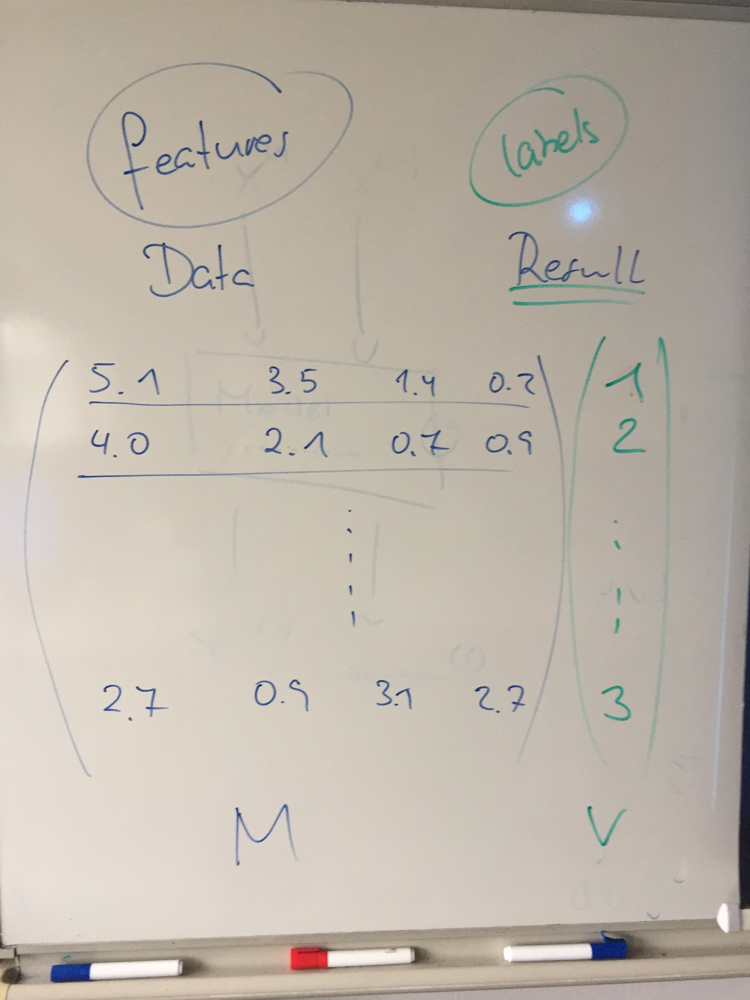

# 2 Matrizen und Vektoren

#### Inhalte 

* Colab Notebook [BW\_ML\_110](https://github.com/Prof-Greipl/bwb-610-fsm-machine-learning/blob/master/colab_notebooks/BW_ML_110_Phython_Vectors%20and%20Matrices.ipynb)
  * Simple Statements in Python
  * Vektoren und Matrizen
  * Funktionen von NumPy
* Begriffe
  * Feature, Label, Dataset \(Foliensatz `ML03 Feature Set, Label, Data Set)`

#### Fragen

1. Erläutern Sie den Zusammenhang dieses Bildes mit ML.



2. Was versteht man in Python unter dem `shape` eines NumPy-Arrays?

3. Erläutern Sie den Zusammenhang zwischen `shape` und `dimension` eines NumPy-Arrrays

#### Lösung zu ausgewählten Übungen

#### Exercise 6

```python
M = np.random.rand(5,1000)
v = np.ones(1000)
e = np.dot(M,v)
print( e )
```


### Definition of a Neuron

$$
a = b c = t
$$

