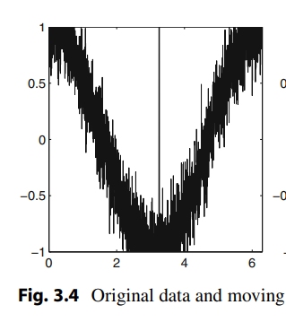

# Fragen

1. Erläutern sie das Konzept des Maschinellen Lernens \(ML\).
2. Bewerten sie folgende Aussagen:
   1. ML ist ein Teilgebiet der Künstlichen Intelligenz \(KI\)
   2. ML und KI beschreiben identische Konzepte
   3. ML ist der Oberbegriff für alle Verfahren innerhalb der KI
3. Erläutern sie den _Turing Test_
4. Welche Frage illustriert des sog. _Chinese Room Experiment_?

